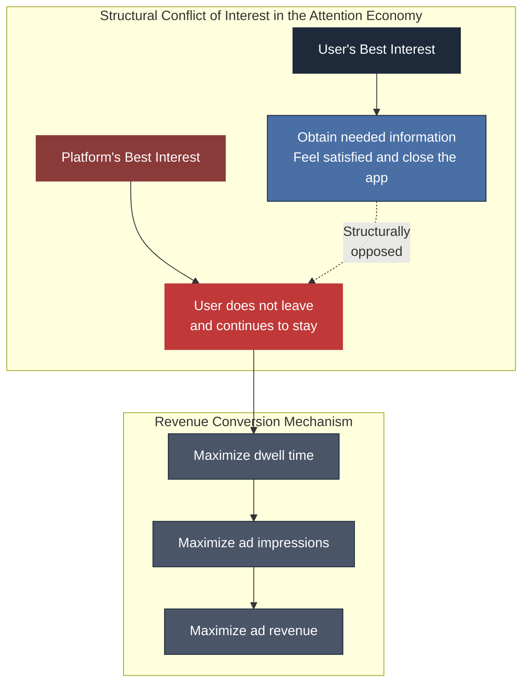
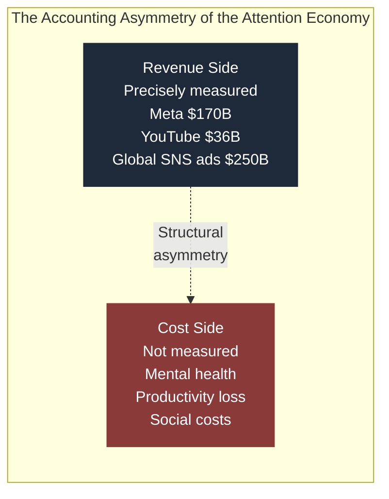
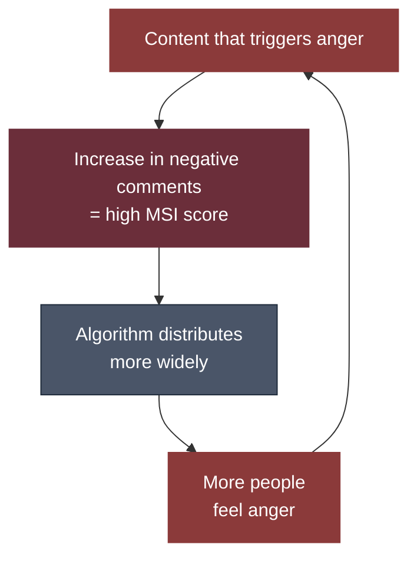
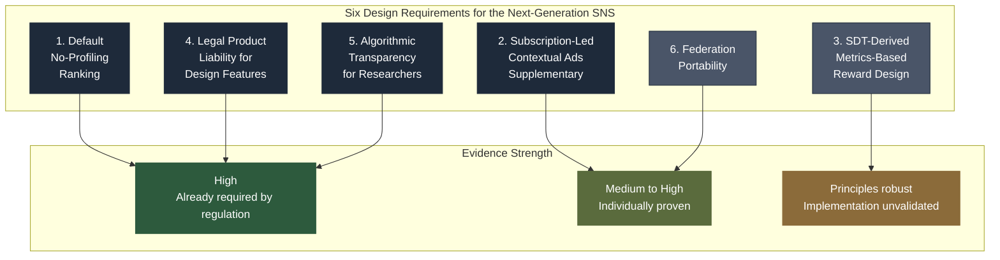

# The End of the Attention Economy. What Should the Next SNS Look Like?
アテンション・エコノミーの終わり。次世代SNSの在り方とは？

[](https://creativecommons.org/licenses/by/4.0/)
[](https://github.com/Leading-AI-IO/the-attention-economy-is-over/blob/main/docs)


<br/>

---

## Foreword

Did you open social media today of your own will?
Or did you find yourself already scrolling before you realized it?

Few people can answer this question honestly.
Because the very act of opening social media has been designed.

On March 25, 2026, a jury in the Los Angeles County Superior Court ordered Meta and Google to pay a combined $6 million (approximately ¥900 million) in damages.
The plaintiff was a 20-year-old woman who began using YouTube at age 6, transitioned to Instagram at age 9, and started experiencing anxiety and depression around age 10.

The basis on which the jury found liability was not the "content" that users had posted.
It was the "design itself" of the platform.

Infinite scroll. Autoplay. Push notifications. The variable reward of "likes."
These are not accidental byproducts.
They were intentionally designed to hold a user's attention for even one more second and convert that second into advertising revenue.

Two days after this verdict, a New Mexico court ordered Meta to pay $375 million (approximately ¥56.3 billion) in penalties.
Federal-level class action lawsuits in the United States exceeded 2,053, with school district lawsuits alone surpassing 250.

Internal Meta documents were submitted as evidence in court.
Documents were disclosed indicating that "to acquire teens at scale, we need to onboard them while they are still in elementary school."

This is a turning point in the history of social media.

For more than 20 years, social media has been accepted by society as a "platform that connects people."
Whenever problems arose, responsibility was attributed to content.
Hate speech, fake news, bullying — everything was handled as a question of "what was posted."

But in 2026, the courts reached a different conclusion.

The problem is not "what was posted."
It is "how it was displayed, how users were pulled back, and how it was made difficult to leave."

In other words, the problem is not content. It is design.
It is the business model behind the design.
The business model that extracts user attention and converts it into advertising — the "attention economy."

This book depicts the reality that the attention economy is structurally coming to an end.

And it asks what comes next.

I have written 14 books as open source.
All of them were written from the perspective of "how to leverage AI" and "how AI is transforming society."
D&V, 10:80:10, The Orchestrator, SaaS Is Dead, A Trillion Dollars and a Firebomb.
All were books that viewed the world from the side of technology.

This 15th book looks from the opposite side.
From the side of the humans whose attention has been continuously extracted by technology.
And it traces why that structure is now collapsing, drawing from primary sources in legal evidence, economic data, and behavioral psychology.

I will not write answers.
However, the design requirements that the next SNS must satisfy can already be described.
Those design requirements exist at the point where three axes converge: legal regulation, behavioral psychology, and alternative revenue models.

This book presents those design requirements.

When you finish reading, you will look at your smartphone once more.
And you will ask yourself again whether you opened social media of your own will, or whether you were made to open it.

That question is both the starting point and the destination of this book.

<br/>

---

## Table of Contents

* **Prologue:** The $6 Million Verdict — The Day the Court Judged "Design"
* **Chapter 1:** Anatomy of the Attention Economy — "Dwell Time" Equals "Revenue"
* **Chapter 2:** The Court Judged "Design" — The Paradigm Shift from Content Liability to Design Liability
* **Chapter 3:** The Invisible $1 Trillion Cost — Mental Health, Productivity, and Lost Time
* **Chapter 4:** The Attention Tax — "The Risk of Having Your Attention Extracted" Becomes a New Axis of Inequality
* **Chapter 5:** The "Metrics Trap" That Facebook Proved — The Failure of MSI and Its Structural Lessons
* **Chapter 6:** Experiments in Transition — What Moved and What Failed
* **Chapter 7:** Redesigning Creator Compensation — From Impressions to Value
* **Chapter 8:** What Is "True Engagement"? — Design Principles from Self-Determination Theory
* **Chapter 9:** Design Brief — Six Design Requirements for the Next-Generation SNS
* **Epilogue:** Not Answers, but a Blueprint

<br/>

---

# Prologue

## The $6 Million Verdict — The Day the Court Judged "Design"

March 25, 2026, Monday.
Los Angeles County Superior Court. The jury concluded its deliberation.

The plaintiff was Kaylee (pseudonym), age 20.
She began using YouTube at age 6 and transitioned to Instagram at age 9.
She began experiencing anxiety around age 10 and eventually developed symptoms of depression.

The defendants were Meta Platforms and Google.

The verdict the jury delivered was $6 million (approximately ¥900 million) in damages.

The historic significance of this verdict lies not in the amount.
It lies in **the basis on which the jury found liability**.

It was not about the content Kaylee saw.
Not the bullying posts directed at Kaylee.
Not the harmful comments someone wrote.

What the jury found problematic was **the design of the platform itself**.

### The Legal Tactic That Bypassed the Section 230 Wall

In the United States, there is a law called Section 230 of the Communications Decency Act.
Enacted in 1996, this provision has protected platforms from legal liability for content posted by third parties.

For more than 20 years, this provision served as a shield for social media companies.
"We merely provide a venue. Responsibility for content lies with the person who posted it" —
Under this logic, countless lawsuits were dismissed.

However, Kaylee's legal team adopted a different tactic.
Rather than pursuing liability for content,
they made **"product defect" in algorithmic design** the central argument.

Infinite scroll intentionally eliminates the natural stopping cues that allow the brain to decide "I should stop now."
Autoplay strips users of the autonomy to actively choose the next piece of content.
The variable reward of "likes" uses the same psychological mechanism as slot machines — a variable ratio reinforcement schedule —
generating anticipation about what reaction might come next.

These did not happen by accident.
They were intentionally designed, applying insights from behavioral psychology and neuroscience,
to maximize user dwell time.

The legal team's argument was this:

"This is not a content problem. **The product design itself is defective.**
If a car's brakes are defective, the manufacturer can be held liable.
If an SNS design contains defects that erode human autonomy, the same logic should apply."

The jury accepted this argument.

### What Happened After the Verdict

Two days after this verdict, New Mexico ordered Meta to pay
$375 million (approximately ¥56.3 billion) in penalties.

At the federal level, class action lawsuits exceeded 2,053 as of October 2025.
In California state courts, approximately 800 additional cases were consolidated separately.

In October 2023, attorneys general from 42 states sued Meta.
The claim was that the company "designed and deployed harmful features intended to deliberately addict children and adolescents."

In January 2026, TikTok settled just before its first jury trial.
Internal documents containing the statement that "algorithmic addiction can be formed in as little as 35 minutes" were cited as a factor in the settlement.

Beyond the courts, change was accelerating.

In February 2024, the European Commission published a preliminary view that TikTok's infinite scroll, autoplay, push notifications,
and highly personalized recommender systems violated the Digital Services Act (DSA).
The Commission demanded that TikTok make **changes to the basic design of its service**.

In December 2024, Australia enacted the world's first law banning social media use for those under 16.
Platforms in violation face penalties of up to A$50 million (approximately ¥5.1 billion).

In December 2025, the European Commission imposed a fine of €120 million (approximately ¥20 billion) on X (formerly Twitter)
for violations of DSA transparency obligations.
It was the first major monetary penalty under the DSA.

In Japan as well, the "Act on Promotion of Competition for Smartphone Software" was enacted in June 2024,
establishing a legal framework prohibiting algorithmic self-preferencing.
In April 2026, the Ministry of Internal Affairs and Communications began considering requiring SNS operators to include age-appropriate filtering features as standard.

| Year | Event | Significance |
|---|---|---|
| 1996 | Section 230 of the Communications Decency Act enacted | Exempted platforms from content liability |
| 2018 | Genesis of Frances Haugen's internal disclosure (Facebook MSI shift) | Design problems became visible from the inside |
| 2022 | EU Digital Services Act (DSA) enacted | Mandated systemic risk assessment for algorithmic design |
| October 2023 | Attorneys general from 42 US states sued Meta | State governments formally asserted design liability |
| February 2024 | European Commission flagged TikTok's "addictive design" | Demanded changes to basic design |
| December 2024 | Australia's under-16 social media ban enacted | World's first age restriction law |
| December 2025 | First major DSA fine of €120M imposed on X (formerly Twitter) | Monetary penalty for transparency violations |
| January 2026 | TikTok settled (just before trial) | Avoided exposure of internal documents |
| March 2026 | Los Angeles County $6 million verdict | "Design = defective product" recognized by jury |

This table points in one direction.

**From "what was posted" to "how it was designed."**

The focus of legal liability for social media has shifted from content to design.
This is not a change in legal detail.
**It is a paradigm shift.**

And this paradigm shift confronts us with a question.

If design is the problem, then what is the business model that produced that design?

The answer is singular.
The attention economy.
A business model that extracts user attention, maximizes dwell time, and converts each second into advertising impressions.
This business model created infinite scroll. Created autoplay. Created variable rewards.

What the courts judged was not Meta, nor Google, nor TikTok.
**It was the attention economy itself.**

## References

1. TruLaw. "Social Media Mental Health Lawsuit — MDL 3047 Update." March 2026.
   https://trulaw.com/social-media-mental-health-lawsuit/
2. NPR. "Meta and YouTube head to trial over harm to children after TikTok settles." January 27, 2026.
   https://www.npr.org/2026/01/27/nx-s1-5684196/social-media-kids-addiction-mental-health-trial
3. European Commission. "Digital Services Act: keeping us safe online." September 2025.
   https://commission.europa.eu/news-and-media/news/digital-services-act-keeping-us-safe-online-2025-09-22_en
4. eSafety Commissioner (Australia). "Social media age restrictions."
   https://www.esafety.gov.au/about-us/industry-regulation/social-media-age-restrictions
5. BUSINESS JOURNAL. "Meta and Google ordered to pay damages for 'addictive design'… wave of global regulation and annual $1 trillion productivity loss." April 29, 2026.
   https://biz-journal.jp/economy/post_394473.html

<br/>

---

# Chapter 1

## Anatomy of the Attention Economy — "Dwell Time" Equals "Revenue"

The core of social media's business model is astonishingly simple.
It sells users' "attention" as advertising inventory.
Every second a user keeps the app open is directly converted into advertising revenue.
The longer the dwell time, the more ads are displayed.
The more ads displayed, the more revenue the platform generates.

Understanding this structure explains every design decision social media makes.

Why infinite scroll?
Because eliminating an endpoint removes the natural stopping cue that lets the brain decide "I should stop now."
Why autoplay?
Because it eliminates the need for users to actively decide "I'll watch the next one," keeping them passively engaged.
Why push notifications?
Because they can pull users back who have left the app.
Why do "like" counts fluctuate?
Because the uncertainty of not knowing what reaction will come next drives users to check repeatedly.

None of this is accidental.
It is design that intentionally applies insights from behavioral psychology and neuroscience.

### 1.1 The Same Psychological Mechanism as Slot Machines

A study published in *Nature Human Behaviour* in 2024 reported that
responses to infinite scroll feeds activate dopamine reward circuits similar to those triggered by gambling.
In psychology, this is called a **variable ratio reinforcement schedule**.

Imagine a slot machine.
The result changes each time you pull the lever. You don't know if you'll win.
But occasionally, you do. This "occasional win" reinforces the behavior of continuing to pull the lever.

Social media feeds share the same structure.
Each scroll reveals something unknown.
It might be a boring post. But occasionally, an interesting one appears.
This uncertainty reinforces the behavior of continuing to scroll.

"Like" notifications work the same way.
A notification might arrive. Or it might not.
Even if it does, it could be 1 or it could be 10.
This variability drives users to check notifications repeatedly.

This did not happen by accident.

Tristan Harris, a former Google design ethicist,
clearly identified this structure in a presentation titled "A Call to Minimize Distraction & Respect Users' Attention," distributed internally at Google in 2013.
He subsequently founded the Center for Humane Technology and testified before the U.S. Senate.

According to Harris's analysis, adding one negative moral-emotional word on Twitter (now X) increased the retweet rate by 17%.
The algorithm has learned this structure.
Content that generates anger produces more engagement.
More engagement produces longer dwell time.
Longer dwell time produces more advertising impressions.

### 1.2 The Accounting of the Attention Economy

Let us examine this structure through numbers.

| Metric | Value | Source |
|---|---|---|
| Meta's 2025 advertising revenue | Approximately $170 billion (¥25.5 trillion) | Meta IR |
| YouTube's 2025 advertising revenue | Approximately $36 billion (¥5.4 trillion) | Alphabet IR |
| TikTok's estimated 2025 advertising revenue | Approximately $23 billion (¥3.5 trillion) | eMarketer |
| Global SNS advertising market size | Approximately $250 billion (¥37.5 trillion) | Statista |

This is the revenue that users' "attention" generates.

And this revenue is proportional to user dwell time.

A 2023 United Nations Working Brief estimated the direct economic contribution of the attention economy at approximately $3 trillion.
However, the same brief explicitly stated that its harms — impacts on mental health, productivity loss, social costs — have not yet been monetized.

In other words, an industry with $3 trillion in economic scale has not accurately measured its "costs."
Revenue is measured. But damage is not.

This is the structural accounting flaw of the attention economy.

### 1.3 The Boundary Between "Beneficial Personalization" and "Erosion of Autonomy"

Here, an important distinction must be introduced.

Social media algorithms inherently possess beneficial functions.
They display content aligned with user interests.
They filter relevant items from a flood of information. This itself is a valuable service.

However, between **providing beneficial personalization** and
**eroding the autonomy of decision-making**, there exists a clear ethical boundary.

"Displaying content that you are likely to find interesting" is personalization.
"Continuously displaying content you cannot tear yourself away from, through an interface designed to make departure difficult" is erosion of autonomy.

The current business model systematically crosses this boundary for economic gain.

Why?
The answer lies in the structure of the business model.

Platform revenue is proportional to the number of advertising impressions.
The number of advertising impressions is proportional to dwell time.
Therefore, **the platform's economic interest is perfectly aligned with maximizing user dwell time**.

Under this structure, "an experience that is beneficial for the user" and "an experience that is profitable for the platform" structurally diverge.

The most beneficial experience for the user might be to obtain the information they need, feel satisfied, and close the app.
But the most profitable experience for the platform is for the user to never close the app.

This structural conflict of interest lies at the core of the attention economy.
And it is this conflict of interest that is being recognized as a "defective product" in the courts.



### 1.4 Why This Structure Has Become a Problem Now

The structure of the attention economy has not fundamentally changed since the Facebook News Feed in 2006.
The same business model has been running for 20 years.

So why is this structure being questioned legally, socially, and politically **now**?

Three changes converged.

**First, evidence accumulated.**
Internal Facebook documents that whistleblower Frances Haugen brought out in 2021.
The 2023 advisory from the U.S. Surgeon General.
The 2024 WHO/HBSC report.
The 2024 *Nature Human Behaviour* paper.
The evidence is no longer at the level of "concern." It has reached the level of "established findings."

**Second, legal tools were established.**
The EU's Digital Services Act (enacted 2022, fully applied 2024).
The UK's Online Safety Act (2023).
Australia's under-16 ban (2024).
The US KOSA/KIDS Act bills.
These laws provided the legal foundation to directly regulate "algorithmic design."

**Third, the scale of harm exceeded a critical threshold.**
Social media usage among US middle schoolers exceeded 95%.
One-third of 13-17 year-olds use social media "almost constantly."
The finding that adolescents who use social media for more than 3 hours a day face a doubled risk of mental health problems was officially presented in the Surgeon General's advisory.

The simultaneous occurrence of these three changes meant that a structure left unquestioned for 20 years was suddenly being challenged from every direction.

That is the present, in 2026.

## References

1. Center for Humane Technology. "For Policymakers: Incentivizing Technology To Be More Humane."
   https://www.humanetech.com/policymakers
2. Tristan Harris. Berkeley Talks transcript: 'Social Dilemma' star on fighting the disinformation machine. 2021.
   https://news.berkeley.edu/2021/02/26/berkeley-talks-transcript-tristan-harris/
3. United Nations. Working Brief: Attention Economy. 2023.
   https://www.un.org/sites/un2.un.org/files/attention_economy_feb.pdf
4. U.S. Surgeon General. Social Media and Youth Mental Health Advisory. 2023.
   https://www.hhs.gov/sites/default/files/sg-youth-mental-health-social-media-advisory.pdf
5. WHO/HBSC. Problematic Social Media Use Among Adolescents. 2024.

<br/>

---
# Chapter 2

## The Court Judged "Design" — The Paradigm Shift from Content Liability to Design Liability

The $6 million verdict described in the prologue is not an isolated incident.
It is merely one node in a legal paradigm shift occurring simultaneously around the world.

The essence of this paradigm shift can be summarized in a single sentence.

**From "what was posted" to "how it was designed."**

For more than 20 years, the legal liability of social media was debated in the dimension of "content."
Did they leave harmful posts up, or remove them? How did they respond to hate speech? How did they handle fake news?

But from 2023 onward, the courts and regulators shifted to a different dimension.
What is being questioned is no longer content.
It is **the algorithmic design itself**.

### 2.1 What 2,053 Class Action Lawsuits Mean in the United States

Under Judge Yvonne Gonzalez Rogers of the US District Court for the Northern District of California, a group of lawsuits has been consolidated as MDL 3047.
As of October 2025, they exceeded 2,053 cases, with approximately 800 additional cases consolidated separately in California state courts.

The defendants include Meta, Google/YouTube, TikTok, Snap, and others.
The plaintiffs are minors and their families who claim to have suffered mental health harm from social media use.

The legal significance of this litigation group lies in the ruling Judge Rogers issued in October 2024.

She allowed claims for negligence and failure-to-warn to proceed to trial.
And she determined that **Section 230 of the Communications Decency Act does not constitute a complete defense**.

The basis for this determination was clear.
Algorithmic promotion of content — recommendation and amplification — differs from merely hosting third-party content.
It is **an act of product design by the platform**.

In other words, the court recognized the following distinction:

| Action | Legal Nature | Section 230 Protection |
|---|---|---|
| Hosting content posted by users | Act as a publisher | Protected |
| Selecting, amplifying, and recommending content via algorithm | Act of product design | **Not protected** |

This distinction is a turning point in SNS legal history.

Simultaneously, action accelerated at the state level. In October 2023, attorneys general from 42 states sued Meta.
The core claim was that the company "designed and deployed harmful features intended to deliberately addict children and adolescents."
In 2024, attorneys general from 14 states filed similar lawsuits against TikTok.

The North Carolina Business Court declined to dismiss deceptive trade practices claims in August 2025.
A New York state court also denied TikTok's motion to dismiss in January 2025.

And in January 2026, TikTok settled just before its first jury trial.
Internal documents contained the statement that "algorithmic addiction can be formed in as little as 35 minutes."
TikTok sought to avoid having this document read aloud in court.

### 2.2 European Union: The Rules Changed by the Digital Services Act

The European Union's Digital Services Act (DSA) was enacted in 2022 and fully applied in 2024.

The DSA reached the same goal as the US lawsuits, but through a different approach.
Not through litigation, but through regulation.

The obligations the DSA imposes on very large online platforms (VLOPs) are qualitatively different from conventional content moderation obligations.

| Previous Regulation | DSA Regulation |
|---|---|
| Obligation to remove harmful content | Obligation to assess and mitigate **systemic risks** posed by recommender systems |
| Responding to illegal content | Prohibition of **addictive design** and **manipulative interfaces** |
| After-the-fact response | **Compliance by Design** |

The DSA redefined platforms not as "mere transmitters of information"
but as "entities that actively shape online spaces through algorithms."

Based on this redefinition, the European Commission has taken concrete action.

In February 2024, it published a preliminary view that TikTok's infinite scroll, autoplay, push notifications,
and highly personalized recommender systems violate the DSA.
In this view, the Commission stated that TikTok needed not merely additional safety tools but
**changes to the basic design of its service**.

This is a qualitative shift in regulation.
Not "remove the content."
"Change the design."

In December 2025, X (formerly Twitter) was fined €120 million (approximately ¥20 billion).
It was the first major monetary penalty under DSA transparency obligations.

Formal investigations and enforcement actions under the DSA have exceeded 86 since April 2023.
This number surpasses the combined total under GDPR, DMA, and the AI Act.

### 2.3 Australia: The World's First Under-16 Ban

In December 2024, Australia enacted the world's first law banning social media use for those under 16.
The "Online Safety Amendment (Social Media Minimum Age) Act 2024" — commonly known as SMMA.
This law targets Facebook, Instagram, Snapchat, Threads, TikTok, Twitch, X, YouTube, Kick, and Reddit, banning account creation for those under 16.
Platforms in violation face penalties of up to A$49.5 million (approximately ¥5.1 billion).

What distinguishes this law from other regulations is the logic of its justification.
The law explicitly cites "design features that encourage them to spend more time on screens" as the basis for the ban.

In other words, the SMMA is a law grounded not in the harmfulness of content, but in **the harmfulness of design**.

Post-enactment effectiveness requires careful evaluation.
Data suggests that more than 20% of 13-15 year-olds continue to access banned apps.
The law's practical effectiveness will require verification over the coming years.

However, the very existence of the law demonstrates one fact.
A sovereign nation has legislated the design of social media as **a product safety issue**.

### 2.4 Japan: An Approach Beginning with Transparency

Japan's approach differs from the EU, the US, and Australia, but points in the same direction.

In June 2024, the "Act on Promotion of Competition for Specified Smartphone Software (SSCPA)" was enacted and came into full effect in December 2025.
This law prohibits major IT companies from "self-preferencing" — prioritizing their own services in search algorithm results without legitimate justification.

Additionally, the "Transparency and Fairness Act for Specified Digital Platforms (TFDPA)," in effect since 2020,
requires designated platforms to disclose algorithmic ranking criteria and submit annual self-assessments.

In May 2025, the "AI Promotion Act" was enacted, but this is a "comply-or-explain" type soft law without the enforcement power of the DSA.

Of particular interest is a 2022 Tokyo District Court ruling.
The court determined that a unilateral change to the evaluation algorithm of the restaurant information site "Tabelog" constituted "abuse of a superior bargaining position" under the Antimonopoly Act.
This is a precedent demonstrating that Japan's competition law can directly address algorithmic design issues.

| Country/Region | Approach | Enforcement Power | Direct Design Regulation |
|---|---|---|---|
| United States | Litigation (Product Liability) | Depends on judicial decisions | Jury recognized "design = defect" |
| EU | Regulation (DSA/AI Act) | Fines of up to 6% of global turnover | Demanded "changes to basic design" |
| Australia | Legislation (SMMA) | Fines of up to A$49.5M | Explicitly cites "design features" as basis for ban |
| United Kingdom | Regulation (OSA) | Risk assessment obligations | Algorithmic transparency and user control rights |
| Japan | Transparency + Competition Law | Self-assessment + JFTC | Tabelog ruling recognized abuse of design |

### 2.5 A Converging Direction

The jurisdictions differ. The methods differ. The degree of enforcement power differs.
But all jurisdictions are heading in the same direction.

**From content liability to design liability.**

This convergence is not coincidental.
The accumulation of evidence points to the same conclusion.

The problem is not content. Content is merely a symptom.
The problem is design. The business model behind the design.

The name of that business model is the attention economy.
The courts and regulators have taken 20 years to finally reach this structure.

```mermaid
graph TB
    subgraph "Convergence of the Legal Paradigm Shift"
        A[1996\nSection 230\n"Content liability lies with the poster"]
        B[2022-2026\nNew Paradigm\n"Design liability lies with the platform"]
        A ==20 years==> B
    end

    subgraph "Paths of Arrival by Jurisdiction"
        C[United States\nProduct Liability Litigation]
        D[EU\nDSA/AI Act Regulation]
        E[Australia\nAge Restriction Legislation]
        F[Japan\nTransparency + Competition Law]
        G[United Kingdom\nOSA Risk Assessment]
    end

    C --> B
    D --> B
    E --> B
    F --> B
    G --> B

    style A fill:#4a5568,stroke:#1e2a3a,color:#fff
    style B fill:#1e2a3a,stroke:#1e2a3a,color:#fff
    style C fill:#6b7b8d,stroke:#1e2a3a,color:#fff
    style D fill:#6b7b8d,stroke:#1e2a3a,color:#fff
    style E fill:#6b7b8d,stroke:#1e2a3a,color:#fff
    style F fill:#6b7b8d,stroke:#1e2a3a,color:#fff
    style G fill:#6b7b8d,stroke:#1e2a3a,color:#fff
```

## References

1. TruLaw. "Social Media Mental Health Lawsuit — MDL 3047 Update." March 2026.
   https://trulaw.com/social-media-mental-health-lawsuit/
2. TruLaw. "TikTok Mental Health Lawsuit (2026 update)."
   https://trulaw.com/social-media-mental-health-lawsuit/tiktok-mental-health-lawsuit/
3. European Commission. "Digital Services Act enforcement." 2025.
   https://digital-strategy.ec.europa.eu/en/policies/dsa-enforcement
4. Tech Policy Press. "Understanding the EU's Digital Services Act Enforcement Against X."
   https://www.techpolicy.press/understanding-the-eus-digital-services-act-enforcement-against-x/
5. eSafety Commissioner (Australia). "Social media age restrictions."
   https://www.esafety.gov.au/about-us/industry-regulation/social-media-age-restrictions
6. ITIF. "Japan's Self-Reporting Rules (TFDPA/SSCPA)." May 2025.
   https://itif.org/publications/2025/05/25/japan-self-reporting-rules/
7. Global Competition Review. "Japan: competition policy and enforcement trends in digital markets."
   https://globalcompetitionreview.com/guide/digital-markets-guide/fifth-edition/article/japan

<br/>

---

# Chapter 3

## The Invisible $1 Trillion Cost — Mental Health, Productivity, and Lost Time

The revenue of the attention economy is measured.
Meta's advertising revenue is approximately $170 billion. YouTube's is approximately $36 billion.
The global SNS advertising market is approximately $250 billion.

But its "costs" are not measured.

The impact on users' mental health.
The loss of worker productivity.
The impact on young people's sleep and academic performance.
The erosion of society's collective "time to think."

These costs are reflected in no one's financial statements, in no GDP calculation.
They accumulate, invisible, as "externalities."

This chapter makes those invisible costs visible, to the extent possible, from primary sources.

### 3.1 The Surgeon General's Advisory — "Cannot Be Concluded as Sufficiently Safe"

In May 2023, the US Surgeon General issued an Advisory on
social media and youth mental health.
This advisory is the most authoritative official document on the health costs of the attention economy.

Key findings of the advisory:

| Finding | Data |
|---|---|
| SNS usage rate among 13-17 year-olds | Up to 95% |
| Proportion using "almost constantly" | Approximately one-third |
| Mental health risk for 3+ hours/day of SNS use | **Doubled** |

The advisory's conclusion was clear.

**"We cannot conclude that social media is sufficiently safe for children and adolescents."**
This is not a political statement calling for regulation. It is a public health judgment based on medical and epidemiological evidence.
The advisory explicitly cited precedents in automotive safety regulation and pharmaceutical safety regulation.
In other words, it positioned social media within **a product safety framework**.
The legal paradigm shift seen in Chapter 2 and the public health judgment have arrived at the same conclusion.

### 3.2 WHO/HBSC International Data — Problematic Use Rose from 7% to 11%

In 2024, WHO Europe/HBSC published survey results from approximately 280,000 children aged 11, 13, and 15 across 44 countries and regions.

"Problematic Social Media Use" —
a usage pattern including dependency-like symptoms such as difficulty controlling use, difficulty disengaging, sacrificing other activities, and negative impacts on daily life —
rose from 7% in 2018 to 11% in 2022.

| Year | Proportion with Problematic Use |
|---|---|
| 2018 | 7% |
| 2022 | **11%** |

A **57% increase** over four years.

Furthermore, the relevant chapter of the World Happiness Report 2026 reported that
this problematic use is **more severe among young people from low-SES (socioeconomic status) households**.

In other words, the health costs of the attention economy are not evenly distributed.
They are disproportionately concentrated among socioeconomically vulnerable populations.

### 3.3 Productivity Loss — The Erosion of Time to Think

In addition to health costs, there are economic costs.

Research from the University of California, Irvine found that it takes an average of 23 minutes and 15 seconds to regain concentration after a single notification interruption.

A peer-reviewed study (2020, published in PMC) of 3,258 employees at a $6 billion US manufacturing company
found that **93.6% of annual productivity loss was attributable to distraction**, equivalent to approximately 15 times the loss from illness-related absenteeism.

A 2024 official report from the French Ministry of the Economy and Finance reported that 34% of internet users (57% among those under 20)
experience at least one harmful effect from screen use (reduced sleep, compulsive urges, etc.).

Globally, approximately 210 million people are estimated to exhibit addictive tendencies toward social media.

| Metric | Value | Source |
|---|---|---|
| Time to regain concentration after a notification | Average 23 minutes 15 seconds | UC Irvine |
| Share of distraction in productivity loss | 93.6% | PMC (2020) |
| Under-20s reporting harmful effects | 57% | French Ministry of Economy (2024) |
| Global population with SNS addiction tendencies | Approximately 210 million | DataReportal (2026) |

However, there is something that must be stated honestly here.

**A rigorous monetary estimate of productivity loss or GDP loss limited specifically to SNS design does not currently exist.**

The OECD addresses the economic costs of mental health problems as a policy issue overall,
but has not published an estimate isolating losses attributable specifically to the attention-extraction design of social media.
The WHO also lacks such a unified estimate.

The commonly cited figure of "annual productivity loss of $1 trillion"
is a broad estimate that includes all forms of digital distraction, and is not limited to social media design.

This book does not blur this distinction.
The social costs of the attention economy are immense.
However, their precise monetary conversion has not yet been performed by anyone.

The fact that these "unmeasured costs" exist is itself part of the problem.
Revenue is measured down to the dollar.
Costs are measured by no one.



### 3.4 An Honest Discussion on Causation

Here, another important note must be inserted.

**Academic debate continues regarding the strength of the causal relationship** between social media use and deterioration of mental health.

Jonathan Haidt argued in his book *The Anxious Generation* that
anxiety among American youth increased by 134% and depression by 106% between 2010 and 2018,
and claimed a causal relationship with social media.

On the other hand, Candice Odgers (UC Irvine/Duke University), in a 2024 commentary in *Nature*,
argued that this causal claim is overstated and that the possibility of reverse causation
(that mentally distressed youth use social media more) cannot be excluded.

This book's position is clear.

**The population-level correlation is robust. However, the magnitude of the causal relationship is contested.**

These two statements are held simultaneously.

The fact that the correlation is robust is sufficient to justify policy responses.
However, asserting causation definitively would not be honest given the current evidence.

This book does not write answers. It depicts structures.
To depict structures means to distinguish, and show separately, the parts of the evidence that are strong and those that are weak.

## References

1. U.S. Surgeon General. Social Media and Youth Mental Health Advisory. 2023.
   https://www.hhs.gov/sites/default/files/sg-youth-mental-health-social-media-advisory.pdf
2. WHO/HBSC. Problematic Social Media Use Among Adolescents. 2024.
3. French Treasury. Trésor-Economics No. 369. "The Attention Economy." September 2025.
   https://www.tresor.economie.gouv.fr/Articles/eb20b27a-6d7d-43ac-ba27-b47b68def354/files/a9bbf4b6-2dc4-463c-926a-dd5385cc291f
4. PMC. "Ill health and distraction at work: Costs and drivers for productivity loss." 2020.
   https://www.ncbi.nlm.nih.gov/pmc/articles/PMC7108714/
5. PMC. "Is the social media creating an anxious youth?" 2024.
   https://pmc.ncbi.nlm.nih.gov/articles/PMC11384441/

<br/>

---

# Chapter 4

## The Attention Tax — "The Risk of Having Your Attention Extracted" Becomes a New Axis of Inequality

In the early 2000s, the term "digital divide" was coined.

It was defined by **the presence or absence of access** to technology.
The wealthy could connect to the internet; the poor could not.
The gap between the haves and the have-nots.
The solution was straightforward — expand connectivity.

But in 2026, this divide has **reversed**.

The problem is no longer the presence or absence of access to technology.
The problem is the presence or absence of **the ability to disengage** from technology.

### 4.1 Why Silicon Valley Engineers Send Their Children to Screen-Free Schools

The Waldorf School of the Peninsula in Los Altos, California.
This school practices education that uses neither computers nor screens.

Examine the school's parent roster and a fact becomes apparent.
Employees of Google, Apple, Yahoo, HP, and eBay are listed.

Steve Jobs reportedly imposed strict limits on his children's iPad usage.
Bill Gates did not give his children smartphones until they turned 14.
Former Facebook executive Chamath Palihapitiya publicly stated, "We have created tools that are ripping apart the social fabric."

They understand, better than anyone, the true nature of what they designed.
That is precisely why they keep their own children away from it.

### 4.2 The Reversal of the Digital Divide

Let us capture the structural meaning of this phenomenon.

| Era | Definition of the Gap | Advantaged Side | Disadvantaged Side |
|---|---|---|---|
| 2000s | Presence or absence of access to technology | Wealthy with connectivity | Poor without connectivity |
| 2026 | Presence or absence of ability to disengage from technology | Wealthy who can shield children from algorithms | Low-income families with prolonged algorithmic exposure |

Wealthy families can "purchase" screen-free private schools, tutors, and offline extracurricular activities.
These are all investments in protecting children's cognitive resources from algorithmic extraction.

Meanwhile, children from low-income households are heavily dependent on ad-supported, inexpensive edtech and social media.
Homework is submitted via Google Classroom, communication with friends happens on Instagram, and idle time is filled by TikTok.

Researchers have begun calling this structure the **"Attention Tax."**

It is the concept that the limited resource of low-income populations' cognitive capacity is being disproportionately extracted to generate platform advertising revenue.

In academia, the concept of "cognitive justice" has been proposed.
Just as public education and healthcare are guaranteed, access to "attention-supporting digital environments" protected from manipulative algorithmic design should be guaranteed regardless of economic status, the argument goes.

### 4.3 Strength and Limitations of the Evidence

Here, for the sake of this book's intellectual honesty, the limitations of the evidence must be stated explicitly.

**The claim that the "attention tax has become a new axis of inequality" is
a socially observed pattern, not a proposition whose causation has been rigorously proven.**

It is a fact that children of tech company employees are disproportionately represented at Waldorf schools.
However, a 2019 Education Week survey showed that **wealthy children are more likely to own personal devices**,
and that **students in lower-income public schools use digital devices in class more frequently**.

Furthermore, Ames at UC Berkeley, in a 2019 essay in the LA Review of Books,
critically examined the narrative of "Silicon Valley's tech-free schools" and pointed out
that the same parent demographic has a higher rate of vaccine hesitancy.
That is, they may not be acting based on special insight into technology,
but may simply be ideologically drawn to alternative education.

A rigorous academic quantification of "attention capture risk" by income quintile does not exist as of April 2026.

This book's position is as follows:

The concept of the attention tax is a useful framework for understanding social structures.
A small but visible cultural phenomenon (elite screen-free education) and
documented exposure disparities (longer usage hours among low-income children) are confirmed.
However, rigorous proof of causation is deferred to future research.

To depict structures means to distinguish, and show separately, what is visible and what is not.

## References

1. CNBC. "Waldorf Schools teach without technology." 2019.
   https://www.cnbc.com/2019/06/07/waldorf-schools-teach-without-technology-heres-what-it-is-like.html
2. Education Week. "Debunking the Myth That Rich Parents Don't Want Tech for Their Kids." 2019.
   https://www.edweek.org/leadership/debunking-the-myth-that-rich-parents-dont-want-tech-for-their-kids/2019/02
3. LA Review of Books. Ames. "The Smartest People in the Room?" 2019.
   https://lareviewofbooks.org/article/the-smartest-people-in-the-room-what-silicon-valleys-supposed-obsession-with-tech-free-private-schools-really-tells-us/
4. Equitech Futures. "The Future of Attention."
   https://www.equitechfutures.com/articles/the-future-of-attention

<br/>

---
# Chapter 5

## The "Metrics Trap" That Facebook Proved — The Failure of MSI and Its Structural Lessons

If the attention economy is the problem, then why not just change the metrics?
Why not optimize for something more "meaningful" instead of dwell time?

This hypothesis sounds intuitively correct.
And Facebook actually attempted it.

The result was catastrophic.

### 5.1 The Shift to "Meaningful Social Interaction"

In January 2018, Mark Zuckerberg issued a statement.

He would change the goal of the News Feed algorithm from "finding relevant content"
to "promoting more Meaningful Social Interaction (MSI)."

What was MSI?
A system where the algorithm calculates an MSI score for each post and ranks the feed based on that score.
Specifically, it used a machine learning model P(user, item, int-type) to predict
the probability that a specific user would take an action such as a "like" or "comment" (high-intensity engagement) on a specific post.

It prioritized active interactions like comments and shares (high-intensity usage) over passive scrolling (low-intensity usage).

Zuckerberg announced this as "a better experience for people."

### 5.2 The Unintended Consequences MSI Triggered

However, long-term research by Acemoglu et al. (2024, 2025) and
the 2021 US Senate testimony of whistleblower Frances Haugen
revealed what the MSI shift actually caused.

By prioritizing "high-intensity engagement" such as comments and shares,
the algorithm inadvertently favored **divisive, sensational content**.

Internal documents recorded this structure clearly.

**"The more negative comments (anger and backlash) a piece of content generates,
the more likely that link is to receive greater traffic."**

Angry reactions were given **5 times** the weight of regular "likes."

In other words, the MSI algorithm generated the following loop:



Haugen stated in her US Senate testimony:

Facebook's internal governance was centered around a single "metric" — MSI.
Moving that metric became the paramount objective, making it impossible to stop social harm.

### 5.3 Instagram's Contradiction

Instagram, under the same Meta umbrella, took a different approach.

It publicly claimed to emphasize qualitative metrics such as "Time Well Spent" and "Daily Active People (DAP)."

Yet simultaneously, it introduced AI-driven recommendation engines (such as Reels) that increased engagement time by approximately 24%.

This is a contradiction.
Claiming to value "time well spent" while implementing an engine that extends dwell time by 24%.

The root of this contradiction is obvious.
**As long as the platform depends on an advertising model, structurally balancing
"improving quality for the user" and "retaining the user" is impossible.**

### 5.4 The Structural Lesson MSI's Failure Teaches

The lesson derived from MSI's failure can be condensed into a single sentence.

**Without changing the underlying advertising business model (impression-dependent),
merely manipulating the surface-level definition of engagement metrics
only changes the "flavor" of attention extraction and does not contribute to making the platform healthier.**

From passive scrolling to active anger.
The "flavor" changed.
But the fundamental structure of extracting user attention and converting it into advertising did not change by a single bit.

This is not a metrics problem.
**It is a business model problem.**

A platform where the advertising model accounts for 99% of revenue
optimizing its algorithm in a direction that "does not maximize dwell time"
means intentionally reducing its own revenue.

Shareholders will not permit that.
And management will not do it voluntarily.

MSI began with good intentions.
But the structure of the business model converted good intentions into harmful outcomes.

This lesson is one of the most important findings for considering the design requirements of the next-generation SNS.

**Changing metrics is not enough.**
**The business model must be changed.**

## References

1. CESifo Working Paper No. 10011 (Acemoglu et al.). "Social Media and Society."
   https://www.ifo.de/DocDL/cesifo1_wp10011.pdf
2. Columbia Academic Commons. "Understanding Social Media Recommendation Algorithms."
   https://academiccommons.columbia.edu/doi/10.7916/1h2v-pn50/download
3. Rev. Facebook Whistleblower Frances Haugen Testifies — Full Senate Hearing Transcript.
   https://www.rev.com/transcripts/facebook-whistleblower-frances-haugen-testifies-on-children-social-media-use-full-senate-hearing-transcript
4. Yale School of Management. "Regulating Content Recommendation Algorithms in Social Media."
   https://som.yale.edu/sites/default/files/2022-05/DPRC-Holdheim.pdf

<br/>

---
# Chapter 6

## Experiments in Transition — What Moved and What Failed

If the attention economy is structurally collapsing, what is the alternative?

Over the past several years, multiple platforms have attempted to answer this question experimentally.

The results are rich with lessons.
And to be honest, the success stories are limited.

### 6.1 BeReal — The Limits of Anti-Attention Design's Attraction and Sustainability

BeReal was born in 2020 with a clear anti-attention design philosophy.

No infinite scroll. No filters.
A single daily prompt to take and post a photo within 2 minutes.
Editing and competition over like counts were eliminated.

This concept resonated strongly with users.
By 2022, monthly active users reached approximately 73 million.

However, what happened next revealed the structural limitations of anti-attention design.

User numbers plummeted.
The "once-a-day experience," the moment it lost its novelty, became a reason for departure.
Short dwell time means no room to display ads. The revenue model was unsustainable.

In mid-2024, BeReal was acquired by French game developer Voodoo for approximately €500 million (approximately ¥80 billion).

What BeReal's experiment teaches is the following:

**Anti-attention design has the power to attract users.**
**However, the power to retain users and generate revenue has not yet been proven.**

### 6.2 Bluesky and Mastodon — The Possibility and Reality of Decentralized SNS

Bluesky and Mastodon attracted attention as alternatives for those leaving X (formerly Twitter).

As of early 2026, Bluesky reported approximately 36 million accounts,
and Mastodon reported approximately 10 million registered accounts (with approximately 270,000 daily active users on major servers).

Both platforms share a default chronological feed.
Bluesky further offers a "composable feed" feature that allows users to choose their own algorithms.

However, neither has established a monetization model.
Mastodon is operated on donations, and Bluesky is funded by venture capital. Both are ad-free.

| Platform | Accounts | Revenue Model | Ads |
|---|---|---|---|
| Bluesky | ~36 million | Venture capital | None |
| Mastodon | ~10 million | Donations | None |
| BeReal | ~73 million (peak) | Acquired | None |

Anti-attention or decentralized SNS platforms have each managed to reach "tens of millions" of users.
But they are two orders of magnitude smaller than Meta's and TikTok's "billions."

And none has a sustainable revenue model.

### 6.3 The Graveyard of Failures

Looking back through history, SNS platforms brandishing "anti-advertising," "privacy-focused," or "intimacy-focused" mantras have appeared numerous times.

| Platform | Concept | Peak | Outcome |
|---|---|---|---|
| Ello (2014) | "Anti-advertising" manifesto | Temporary buzz | Failed to retain users |
| Vero (2018) | Paid model | Temporary surge | Failed to achieve scale |
| Path (2010-2018) | Intimacy-focused (150-friend limit) | Niche use | Service terminated |

The common causes of failure are two.

First, **differentiation was insufficient after novelty wore off**.
Second, **there was no way to raise growth capital without advertising**.

This paradoxically proves the structural strength of the attention economy.
The advertising model gives platforms a self-reinforcing growth engine: "provide for free, gather users, extract attention, recover through ads."
No SNS has reached equivalent scale without this engine as of April 2026.

### 6.4 The Structural Implications of These Experiments

BeReal, Bluesky, Mastodon, Ello, Vero, Path.

The conclusion derived from these experiments is harsh but clear.

**"The alternative to the attention economy" works as an ideal.**
**But it has not yet worked as a business.**

Anti-attention SNS platforms in the tens of millions of users exist.
Anti-attention SNS platforms in the billions of users do not exist.

No general-purpose SNS that is ad-free and sustainably profitable exists.

This is also the reason this book cannot present a "completed model for the next-generation SNS."
A completed model does not yet exist.

However, design requirements can be described.
In the following chapters, we will examine the elements that constitute those requirements.

## References

1. Flockler. "Bluesky vs Mastodon — 10 key points."
   https://flockler.com/blog/bluesky-vs-mastodon
2. IFTTT. "Bluesky vs Mastodon: What are the differences?"
   https://ifttt.com/explore/bluesky-vs-mastodon
3. Swat.io. "The Best X Alternative: Bluesky, Threads, or Mastodon?"
   https://swat.io/en/learn/x-alternatives-bluesky-threads-mastodon/

<br/>

---

# Chapter 7

## Redesigning Creator Compensation — From Impressions to Value

If the attention economy breaks, what will creators live on?

This is one of the most urgent questions in the structural transformation of social media.

Creators active on YouTube and Instagram earn their livelihood within the current business model.
CPM (Cost Per Mille: advertising revenue per 1,000 impressions) is their lifeline.

However, the CPM model has a structural problem.
Without generating millions of views, creators cannot earn a livable income.
As a result, creators resort to clickbait and extreme content generation.
They must create content favored by the algorithm, or their revenue disappears.

This is not the degradation of creators.
**The structure of the business model is degrading the quality of content.**

### 7.1 The Alternative Model Substack Proved

Substack is the most compelling counterevidence to this structure.

Substack's model is simple.
Creators publish articles and podcasts, and readers pay to subscribe.
Substack collects 10% of subscription revenue as a platform fee (excluding payment processing fees of 2.9% + $0.30).

| Metric | Value | Source |
|---|---|---|
| ARR (Annual Recurring Revenue) | Approximately $45 million | Sacra (2025) |
| Paid subscribers | Approximately 5 million | Substack (2025/3) |
| Total creator revenue (GMV) | Approximately $450 million | Sacra estimate |
| Valuation | Approximately $1.1 billion | Series C (2025/7) |
| Cash flow | Achieved profitability in Q1 2025 | Sacra |

The innovation of this model is that the interests of the platform and creators are **perfectly aligned**.

In the CPM model, the platform's interest is proportional to "number of views."
Therefore, viral content is favored.

In the Substack model, the platform's interest is proportional to "content valuable enough that readers directly pay for it."
Therefore, quality is favored.

**Not "how many millions of times it was viewed," but "is the reader willing to open their wallet to read this?"**

This change in the objective function dramatically changes creator behavior.
Instead of chasing hundreds of thousands of fleeting impressions,
creators focus on building a community of hundreds to thousands of dedicated paid readers.

A benchmark that approximately 10% of Substack readers convert to paid subscribers has also been confirmed.

### 7.2 Alternatives to the Advertising Model — The Revival of Contextual Advertising

Not all advertising is bad.
The problem is the **form** of advertising.

The currently dominant advertising model (behavioral targeting advertising)
collects vast amounts of user behavioral data and displays ads based on profiling.
This model is the engine driving the attention economy.
The more users are tracked, the more precise the ads become.
Tracking requires keeping users on the platform for extended periods.

However, an alternative advertising model exists.
**Contextual advertising** — a model that displays ads based on the context of the content,
not the behavior of the user.

DuckDuckGo has achieved profitability with this model.
Zero behavioral tracking, contextual advertising only.
A DuckDuckGo executive has noted: "It is not targeted advertising itself that is the major privacy invasion.
It is the gravity of data that accumulates around advertising that is the problem."

According to data cited by the Irish Council for Civil Liberties (ICCL),
a Norwegian news media group earned **391% higher revenue on average** with contextual advertising
compared to tracking-based advertising (July 2020 – May 2021).

After Apple's App Tracking Transparency (ATT) was introduced,
the opt-in rate for tracking advertising fell below 25%.
This depressed advertising revenue for Meta and Snap by tens of billions of dollars in 2021-2022.

| Advertising Model | Revenue Mechanism | Algorithmic Incentive |
|---|---|---|
| CPM (Cost Per Mille) | Charged per 1,000 impressions | Maximize dwell time, infinite scroll |
| CPC (Cost Per Click) | Charged per click | Clickbait, emotional content |
| Subscription | Percentage of subscription fees | Content quality, reader trust |
| Contextual | Displayed based on content context | Providing highly relevant content |
| Outcome-based | Charged based on business outcomes | Speed and accuracy of problem-solving |

### 7.3 The Rise of Outcome-Based Advertising

An even more fundamental change is underway in the advertising industry itself.

According to the IAB MENA 2024 report,
approximately 29% of digital advertising budgets are wasted as "impressions with no performance."

Advertisers are beginning to refuse paying for "being displayed."
Instead, a shift toward paying for "business outcomes" has begun.

WPP, the world's largest advertising holding group, is leading negotiations with major clients on
**outcome-based compensation models** as part of its "Elevate28" strategy for 2026.

Zendesk transitioned its AI agent pricing to an outcome-based model in September 2024,
adopting a model that charges based on specific problem resolution for customers.

Deloitte predicts that outcome-based models will become one of the top three drivers of sponsorship growth by 2027.

If this model becomes widespread, platforms will lose the financial incentive to "retain user attention with meaningless content."
Instead, "matching user needs with advertiser solutions as quickly and accurately as possible" will become the source of revenue.

## References

1. Sacra. "Substack revenue, valuation & funding."
   https://sacra.com/c/substack/
2. Backlinko. "Substack User and Revenue Statistics (2026)."
   https://backlinko.com/substack-users
3. Ricky Sutton / Substack. "DuckDuckGo shares how publishers can make a profit from privacy."
   https://rickysutton.substack.com/p/duckduckgo-shares-how-publishers
4. Platformance.io. "Outcome-Based Pricing & Pay Per Outcome Model."
   https://www.platformance.io/post/outcome-based-pricing
5. ALM Corp. "WPP Elevate28 Plan Explained."
   https://almcorp.com/blog/wpp-elevate28-holding-company-restructure-strategy-2026/

<br/>

---

# Chapter 8

## What Is "True Engagement"? — Design Principles from Self-Determination Theory

As we saw in Chapter 5, Facebook tried to solve the problem by "changing the metrics."
The result was failure. If the business model stays the same, changing the metrics only changes the "flavor" of extraction.

Then, assuming the business model does change
— assuming a transition to subscription or contextual advertising —
what should the next-generation SNS optimize for?

What metric should replace "dwell time"?

The most promising answer to this question is provided by
**Self-Determination Theory (SDT)**.

### 8.1 The Basic Structure of SDT

Self-Determination Theory is a psychological theory systematized by Edward Deci and Richard Ryan in 2000 and expanded in 2017 and 2020.

SDT classifies human motivation into two types:

| Type | Definition | Example in SNS |
|---|---|---|
| **Intrinsic motivation** | The activity itself is enjoyable or valuable | Deeply learning about a topic of interest, meaningful dialogue with friends |
| **Extrinsic motivation** | External rewards or punishments drive behavior | Like counts, follower counts, badges, rankings |

SDT posits that human well-being and high-quality engagement arise when
the following **three basic psychological needs** are satisfied:

| Need | Definition | Implications for Platform Design |
|---|---|---|
| **Autonomy** | The sense of directing one's own actions | Users control "what to see" and "when to stop" |
| **Competence** | The sense that one's skills or knowledge are improving | Discovering content that leads to learning and growth |
| **Relatedness** | The sense of meaningful connection with others | Deep dialogue and empathy, not superficial "likes" |

### 8.2 Distinguishing "Addictive Engagement" from "True Engagement"

Using SDT, we can clearly distinguish between "addictive engagement" and "true engagement."

| Dimension | Addictive Engagement (Current SNS) | True Engagement (SDT-Compliant) |
|---|---|---|
| Motivation | Extrinsic (likes, followers, rankings) | Intrinsic (learning, connection, self-expression) |
| Autonomy | Stripped away (infinite scroll, autoplay) | Maintained (user is in control) |
| Competence | Undermined (feelings of inferiority from social comparison) | Supported (skill and knowledge improvement) |
| Relatedness | Superficial (connection as numbers) | Deep (meaningful dialogue and empathy) |
| User state | "I can't stop" | "I want to come back" |

This distinction is theoretically clear.
However, there is something that must be honestly stated here.

### 8.3 Limitations of the Evidence — No Validation in Production Environments

SDT is one of the most cited theories in psychology,
with empirical validation across education, healthcare, sports, organizational behavior, and many other domains.

However, **operational metrics based on SDT have not been validated at scale
in a production SNS environment as of April 2026.**

The Center for Humane Technology has published policy advocacy frameworks,
but has not released specifications for a concrete platform reward system.

Stanford HAI, MIT Media Lab, Oxford Internet Institute, and the Berkman Klein Center
have published partial research findings, but none has been validated at scale in a production environment.

SDT is the most promising theoretical foundation for designing "true engagement."
But it is a theory, not a validated specification.

This book does not blur this distinction.

SDT is sufficiently robust as a **design principle**.
However, the work of converting SDT into **production-level metrics** has not yet been completed by anyone.

This is **the single largest unresolved challenge** in next-generation SNS design.

## References

1. Ryan & Deci. Self-Determination Theory (2020).
   https://stial.ie/resources/Ryan%20and%20Deci%202020%20self%20determination%20theory.pdf
2. Center for Humane Technology. "For Policymakers."
   https://www.humanetech.com/policymakers
3. arXiv. "Self-Determination Theory and HCI Games Research." 2024.
   https://arxiv.org/pdf/2405.12639

<br/>

---

# Chapter 9

## Design Brief — Six Design Requirements for the Next-Generation SNS

Over the preceding eight chapters, we confirmed the following:

In Chapter 1, we anatomized the structure of the attention economy.
In Chapter 2, we confirmed the convergence of the legal paradigm shift.
In Chapter 3, we confirmed the scale of social costs and the absence of their measurement.
In Chapter 4, we examined the attention tax as a new axis of inequality.
In Chapter 5, we learned from Facebook's failure that merely changing metrics does not solve the problem.
In Chapter 6, we confirmed the limitations of anti-attention design experiments.
In Chapter 7, we examined empirical data on alternative revenue models.
In Chapter 8, we confirmed SDT-based design principles and the absence of their validation.

Integrating this evidence, the **design requirements** that the next-generation SNS must satisfy emerge.

This book does not say "the next SNS should look like this."
It says "for the next SNS to be structurally trustworthy, it must at minimum satisfy these requirements."

This is not the presentation of a completed model.
It is the presentation of a **Design Brief**.

### Design Requirement 1: Default Ranking Without Behavioral Profiling

The default should be ranking based on user-declared interests, chronological order, and social graph.
Personalization based on behavioral profiling should be applied only when the user explicitly opts in.

**Evidence strength: High.**
EU DSA Article 38 already mandates that VLOPs offer recommender options not based on profiling.
The US KOSA/KIDS Act bills require an "input-transparent algorithm" as the default for minors.

### Design Requirement 2: Revenue Structure Led by Subscription, Supplemented by Contextual Advertising

The primary revenue axis should be direct user payment (subscription),
with advertising limited to contextual (content context-based) formats.
Behavioral targeting advertising should be excluded or made opt-in only.

**Evidence strength: Medium to high.**
Substack reached unicorn valuation at $45M ARR / $450M creator revenue and achieved profitability in Q1 2025.
DuckDuckGo maintains profitability with contextual advertising alone.
Norwegian publisher data showed contextual advertising yielding 391% higher revenue than tracking advertising.
However, none of these have been verified at the scale of Meta or TikTok.

### Design Requirement 3: Reward Design Based on SDT-Derived Metrics

Platform KPIs and creator compensation should be designed around metrics based on autonomy, competence, and relatedness fulfillment.
A metric system aligned with well-being should be built to replace "like counts," "follower counts," and "dwell time."

**Evidence strength: Principles are robust, but implementation is unvalidated.**
SDT is one of the most established theories in psychology, and its reliability as a design principle is high.
However, no instance exists of SDT being converted into production-level operational metrics.
**This is the single largest open question in next-generation SNS design.**

### Design Requirement 4: Legal Product Liability for Design Features

Design features of the platform (recommender systems, notification design, feed structure)
should incorporate a legal duty of care for product safety.
Compliance by Design should be assumed from the design stage.

**Evidence strength: High.**
The MDL 3047 judge determined that algorithmic promotion is not protected by Section 230.
42 states sued Meta on design liability grounds.
Australia's SMMA explicitly cites "design features" as the basis for the ban.
The EU DSA demanded "changes to basic design."

### Design Requirement 5: Algorithmic Transparency for Researchers

Qualified researchers should be structurally guaranteed data access to recommender system logic and its impacts.

**Evidence strength: High.**
EU DSA Article 40, Japan's TFDPA, and the UK's OSA
all mandate or recommend researcher data access from platforms.

### Design Requirement 6: Federation / Portability

User data, content, and social graphs should be transferable between platforms.
Lock-in to a single platform should be structurally eliminated.

**Evidence strength: Technically proven, but large-scale deployment has not been achieved.**
Bluesky (AT Protocol) and Mastodon (ActivityPub) have proven technical feasibility.
However, both are at the scale of tens of millions of users, and verification at the scale of hundreds of millions has not occurred.



### Overall Evidence Assessment

Of the six design requirements, four (Requirements 1, 4, 5, and part of 2) are already required by regulation or individually proven.
One (Requirement 6) is technically proven but has not achieved large-scale deployment.
One (Requirement 3) is theoretically robust but has no validation in a production environment.

In other words, **the "design requirements" for the next-generation SNS can be described, but a "completed model" does not yet exist.**

What this book presents is not an architectural blueprint but a building code.
Not "build this building like this," but "for this building to be safe, it must at minimum satisfy these requirements."

The person who builds the next-generation SNS may be a reader of this book.
I hope these design requirements serve as the starting point for that construction.

## References

1. European Commission. DSA Articles 27, 34, 35, 38, 40.
   https://digital-strategy.ec.europa.eu/en/policies/dsa-enforcement
2. EU AI Act. High-level summary.
   https://artificialintelligenceact.eu/high-level-summary/
3. AAAI/ACM AIES. Nannini. "From Categorical to Contextual." 2025.
   https://ojs.aaai.org/index.php/AIES/article/view/36678
4. Sacra. "Substack revenue, valuation & funding."
   https://sacra.com/c/substack/
5. Ryan & Deci. Self-Determination Theory. 2020.

<br/>

---

# Epilogue

## Not Answers, but a Blueprint

This book did not write answers.

Is the attention economy "evil"? It did not write that.
Is social media "harmful"? It did not write that.
"The next SNS should look like this"? It did not write that.

What this book wrote is structure.

How the attention economy was designed, how it functions,
and why it is now being simultaneously denied from three directions — the courts, regulators, and society.

Within that structure, what has begun to change.
What has been experimented with, what has succeeded, and what has failed.

And for the next-generation SNS to be "structurally trustworthy,"
what requirements it must, at minimum, satisfy.

It did not write answers. But it wrote design requirements.

---

Let us review this book.

In the prologue, starting from the $6 million verdict of March 2026, we confirmed the fact that the courts judged the "design" of social media.

In Chapter 1, we anatomized the structure of the attention economy.
A business model that extracts user attention second by second and converts it into advertising impressions.
Infinite scroll, autoplay, and variable rewards designed for that purpose. The same psychological mechanism as slot machines.

In Chapter 2, we confirmed the structure by which legal regulation in the US, EU, Australia, UK, and Japan
converges from "content liability" to "design liability."

In Chapter 3, we made visible from primary sources the social costs of the attention economy — mental health, productivity, youth development.
At the same time, we explicitly noted the fact that a precise monetary conversion of those costs has not yet been performed.

In Chapter 4, we examined the structure by which "the risk of having your attention extracted" is becoming a new axis of socioeconomic inequality.
Wealthy families place their children in screen-free environments while children of low-income families are exposed to algorithms for extended periods —
we described the concept of the "attention tax," showing both the strength and limitations of the evidence.

In Chapter 5, we confirmed the structural lesson that Facebook's shift to "Meaningful Social Interaction (MSI)" resulted in a structure that amplified anger.
Changing metrics is not enough. The business model must be changed.

In Chapter 6, we examined the experiments of BeReal, Bluesky, Mastodon, and other anti-attention design platforms.
They work as ideals. But they have not yet worked as businesses.

In Chapter 7, we confirmed empirical data on alternative revenue models: Substack's subscription model, DuckDuckGo's contextual advertising,
and the rise of outcome-based advertising.

In Chapter 8, we confirmed that Self-Determination Theory (SDT) is the most promising theoretical foundation for defining "true engagement,"
but that its validation in a production environment does not yet exist.

In Chapter 9, we integrated this evidence and presented six design requirements for the next-generation SNS.

To you who have read this far, I pose the first question once more.

**Did you open social media today of your own will?**

Or did you find yourself already scrolling before you realized it?
Your answer to this question is the first step in questioning your "agency in your relationship with algorithms."

And the six design requirements presented in this book are the starting point for structurally guaranteeing that agency.
The attention economy is coming to an end.
But what comes next has not yet been decided.

It is not the courts, nor regulators, nor AI companies who will decide.
It is us — who design, build, and choose.

---

## About the Author
**Satoshi Yamauchi**
AI Strategist & Business Designer. Founder / CEO, Leading.AI LLC.
A BTC professional who crosses three domains — Business, Design, and Technology — at a professional level. Publishing knowledge across all themes of "Generative AI × Strategy."
This book is the 15th in the open-source book series published by Leading.AI.

## License

This work is published under the [Creative Commons Attribution 4.0 International License (CC BY 4.0)](https://creativecommons.org/licenses/by/4.0/).
Quoting, redistribution, and modification are free. Please credit the author.
