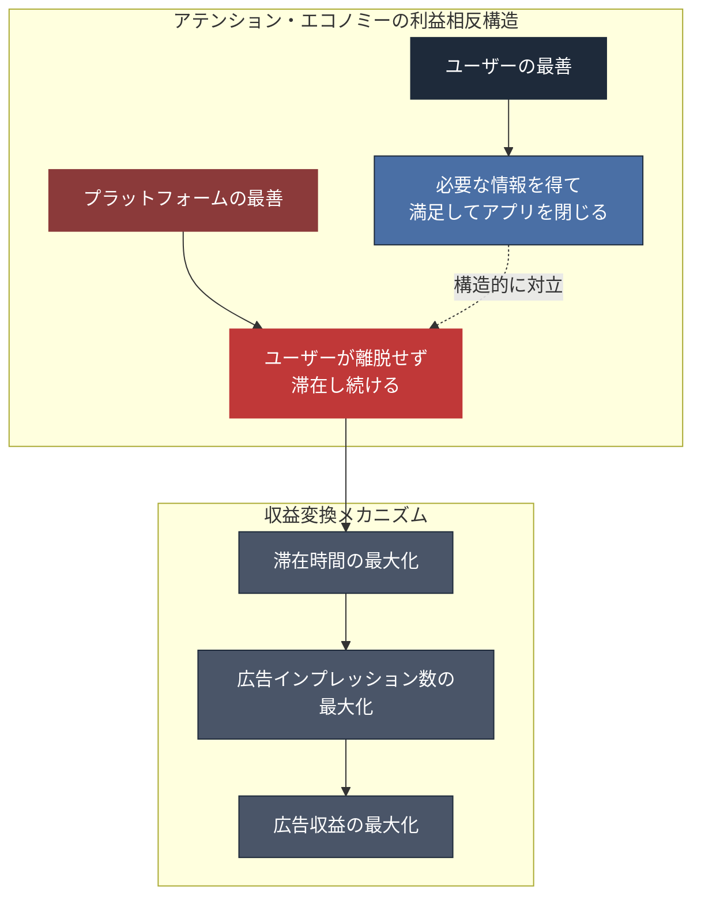
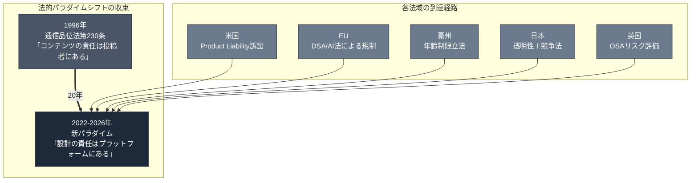
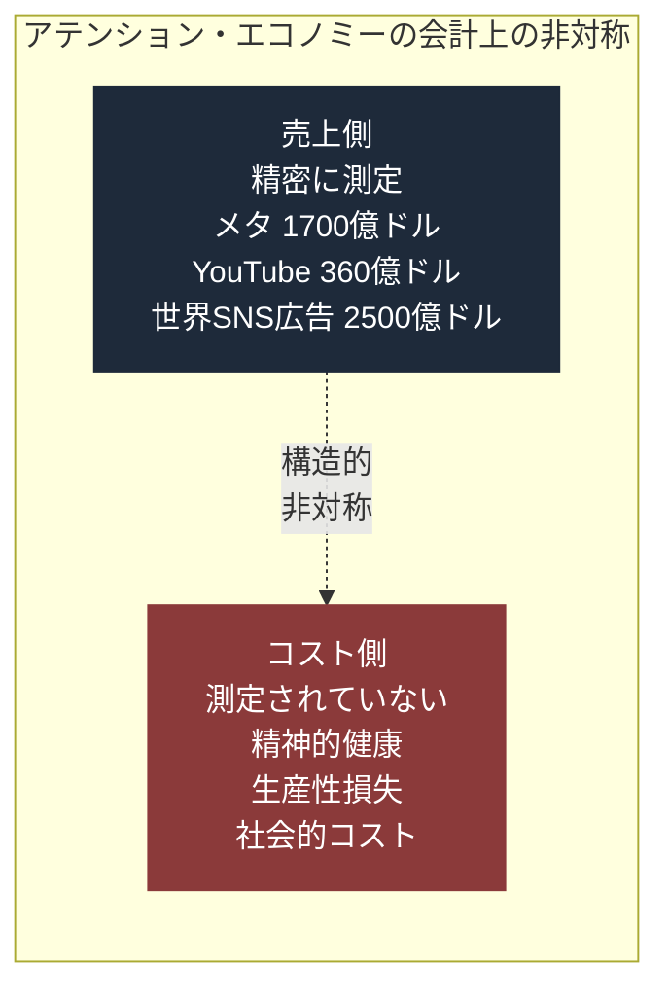
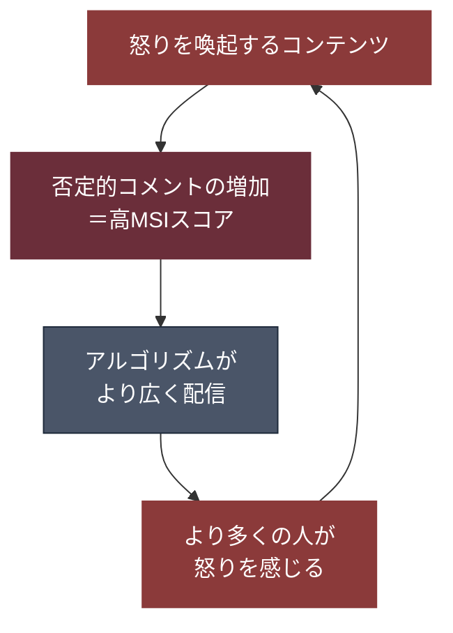
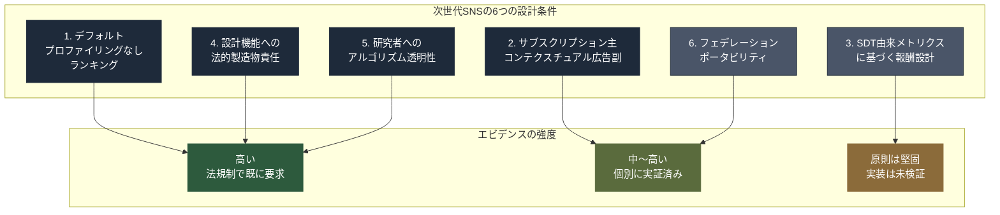

# アテンション・エコノミーの終わり。次世代SNSの在り方とは？
The End of the Attention Economy. What Should the Next SNS Look Like?

 

---

## まえがき

あなたは今日、自分の意思でSNSを開いただろうか。 
それとも、気づいたら開いていただろうか。

この問いに、正直に答えられる人は少ない。 
なぜなら、あなたがSNSを開く動作そのものが、設計されたものだからだ。

2026年3月25日、ロサンゼルス郡上級裁判所の陪審員団は、メタとグーグルに対して総額600万ドル（約9億円）の賠償を命じた。 
原告は、6歳からYouTube、9歳からInstagramを使い始め、10歳ごろから不安やうつを発症した20歳の女性だった。

陪審員が「有責」と判断した根拠は、ユーザーが投稿した「コンテンツ」ではなかった。 
プラットフォームの「設計そのもの」だった。

無限スクロール。自動再生。プッシュ通知。「いいね」の変動的報酬。 
これらは偶然の産物ではない。 
ユーザーの注意を1秒でも長く引き留め、その1秒を広告収益に変換するために、意図的に設計されたものだ。

この評決の2日後、ニューメキシコ州ではメタに対し3億7,500万ドル（約563億円）の制裁金が命じられた。 
米国内の集団訴訟は連邦レベルで2,053件を超え、学校区からの提訴だけで250件を超えている。

法廷ではメタの内部文書が証拠として提出された。 
「ティーンを大量獲得するには、小学生のうちに取り込む必要がある」という趣旨の文書が開示されている。

これは、SNSの歴史における転換点だ。

20年以上にわたって、SNSは「人々をつなぐプラットフォーム」として社会に受け入れられてきた。 
問題が起きるたびに、責任はコンテンツに帰せられた。 
ヘイトスピーチ、フェイクニュース、いじめ——すべて「何が投稿されたか」の問題として処理されてきた。

しかし2026年、法廷は別の結論に達した。

問題は「何が投稿されたか」ではない。 
「どのように見せられ、どのように戻らされ、どのように離脱しにくくされたか」だ。

つまり、問題はコンテンツではなく、設計だ。 
設計の背後にあるビジネスモデルだ。 
ユーザーの注意を抽出し、広告に変換するビジネスモデル——"アテンション・エコノミー"だ。

この本は、そのアテンション・エコノミーが構造的に終わりを迎えつつある現実を描く。

そして、その先に何が来るのかを問う。

私はこれまで14冊の書籍をオープンソースで書いてきた。 
全て「AIをどう活用するか」「AIが社会をどう変えるか」の視点で書いている。 
D&V、10:80:10、オーケストレーター、SaaS Is Dead、1兆ドルと火炎瓶。 
全て、テクノロジーの側から世界を見た本だった。

この15冊目は、反対側から見る。 
テクノロジーによって注意を奪われ続けてきた人間の側から見る。 
そして、その構造がなぜ今、崩壊しつつあるのかを、法的証拠、経済データ、行動心理学の一次ソースから追う。

答えは書かない。 
しかし、次のSNSが満たすべき設計条件は、既に記述可能だ。 
法規制、行動心理学、代替収益モデルの3軸が収束する地点に、その設計条件は存在する。

本書は、その設計条件を提示する。

読み終えたとき、あなたはもう一度、自分のスマートフォンを見るだろう。 
そして、自分の意思でSNSを開いたのか、開かされたのかを、問い直すだろう。

その問いが、この本の出発点であり、終着点だ。

 

---

## 目次

* **序章:** 600万ドルの評決 — 法廷が「設計」を裁いた日
* **第1章:** アテンション・エコノミーの解剖 — 「滞在時間」は「収益」である
* **第2章:** 法廷が「設計」を裁いた — コンテンツ責任から設計責任へのパラダイムシフト
* **第3章:** 1兆ドルの見えないコスト — 精神、生産性、そして失われた時間
* **第4章:** アテンション税 — 「注意を奪われるリスク」が格差の新しい軸になる
* **第5章:** Facebookが証明した「指標の罠」 — MSIの失敗と構造的教訓
* **第6章:** 移行期の実験 — 何が動き、何が失敗したか
* **第7章:** クリエイター報酬の再設計 — インプレッションから価値へ
* **第8章:** 「真のエンゲージメント」とは何か — 自己決定理論が示す設計原則
* **第9章:** Design Brief — 次世代SNSの6つの設計条件
* **終章:** 答えではなく、設計図を

 

---

# 序章

## 600万ドルの評決 — 法廷が「設計」を裁いた日

2026年3月25日、月曜日。 
ロサンゼルス郡上級裁判所。陪審員団は、審理を終えた。

原告はケイリー（仮名）、20歳。 
6歳からYouTubeを使い始め、9歳からInstagramに移行した。 
10歳ごろから不安を訴え始め、やがてうつ症状を発症した。

被告はメタ・プラットフォームズとグーグル。

陪審員が下した評決は、600万ドル（約9億円）の賠償だった。

この評決が歴史的な意味を持つのは、賠償額ではない。 
**陪審員が「有責」と判断した根拠**だ。

ケイリーが見た投稿の内容ではない。 
ケイリーが受けたいじめの投稿でもない。 
誰かが書いた有害なコメントでもない。

陪審員が問題にしたのは、**プラットフォームの設計そのもの**だった。

### 通信品位法第230条の壁を迂回した法的戦術

米国には、通信品位法第230条という法律がある。 
1996年に制定されたこの条文は、プラットフォームを第三者が投稿したコンテンツの法的責任から保護してきた。

20年以上にわたって、この条文はSNS企業の盾だった。 
「私たちは場所を提供しているだけだ。投稿内容の責任は投稿者にある」—— 
この論理で、無数の訴訟が退けられてきた。

しかし、ケイリーの弁護団は別の戦術を採った。 
コンテンツの責任を問うのではなく、 
**アルゴリズム設計という**「**製品の欠陥**」を主軸に据えた。

無限スクロールは、脳が「もうやめよう」と判断する区切りを、意図的に排除している。 
自動再生は、ユーザーが能動的に次のコンテンツを選択する自律性を奪っている。 
「いいね」の変動的報酬は、スロットマシンと同じ心理的メカニズム——変動比率強化スケジュール—— 
を利用して、次にどんな反応が来るかわからない期待感を生成している。

これらは、偶然にそうなったのではない。 
ユーザーの滞在時間を最大化するために、 
行動心理学と神経科学の知見を応用して、意図的に設計されたものだ。

弁護団の主張はこうだ。

「これはコンテンツの問題ではない。**製品の設計が欠陥品である**。 
  自動車のブレーキが欠陥であれば製造者責任を問える。 
  SNSの設計が人間の自律性を侵食する欠陥を含んでいるなら、同じ論理が適用されるべきだ。」

陪審員は、この主張を認めた。

### 評決の後に起きたこと

この評決の2日後、ニューメキシコ州はメタに対して、 
3億7,500万ドル（約563億円）の制裁金を命じた。

連邦レベルの集団訴訟は、2025年10月時点で2,053件を超えていた。 
カリフォルニア州裁判所では、さらに約800件が別途集約されている。

2023年10月には、42州の司法長官がメタを提訴した。 
「子ども・若者を意図的に依存させる有害機能を設計・展開した」という主張だった。

2026年1月、TikTokは初の陪審裁判の直前に和解した。 
内部文書に「アルゴリズムによる依存は最短35分で形成される」という記述があったことが、和解の一因とされている。

法廷の外でも、変化は加速していた。

2024年2月、欧州委員会はTikTokに対して、無限スクロール、自動再生、プッシュ通知、 
高度にパーソナライズされたレコメンダーシステムがデジタルサービス法（DSA）に違反するという暫定的見解を発表した。 
委員会は、TikTokに対して**サービスの基本設計の変更**を求めた。

2024年12月、オーストラリアは世界初の16歳未満のSNS利用禁止法を施行した。 
違反したプラットフォームには最大5,000万豪ドル（約51億円）の制裁金が科される。

2025年12月、欧州委員会はX（旧Twitter）に対して、 
DSA透明性義務違反で1億2,000万ユーロ（約200億円）の罰金を科した。 
DSAに基づく初の主要な金銭的制裁だった。

日本でも、2024年6月に「スマホソフトウェア競争促進法」が成立し、 
アルゴリズムの自己優遇を禁止する法的枠組みが整った。 
2026年4月には、総務省がSNS事業者に対し年齢に応じたフィルタリング機能の標準搭載を検討し始めた。

| 年 | 出来事 | 意味 |
|---|---|---|
| 1996年 | 通信品位法第230条制定 | プラットフォームをコンテンツ責任から免責 |
| 2018年 | Frances Haugen内部告発の端緒（Facebook MSIシフト） | 設計の問題が内部から可視化される |
| 2022年 | EU デジタルサービス法（DSA）制定 | アルゴリズム設計にシステミック・リスク評価を義務化 |
| 2023年10月 | 米42州司法長官がメタ提訴 | 設計責任を州政府が正式に主張 |
| 2024年2月 | 欧州委員会がTikTokの「中毒設計」を問題視 | 基本設計の変更を要求 |
| 2024年12月 | オーストラリア16歳未満SNS禁止法施行 | 世界初の年齢制限法 |
| 2025年12月 | X（旧Twitter）にDSA初の主要罰金€120M | 透明性義務違反で金銭的制裁 |
| 2026年1月 | TikTok和解（裁判直前） | 内部文書の露出を回避 |
| 2026年3月 | ロサンゼルス郡600万ドル評決 | 「設計=欠陥製品」が陪審に認定される |

この表は、一つの方向を指している。

**「何が投稿されたか」から「どのように設計されたか」へ。**

SNSの法的責任の焦点が、コンテンツから設計に移った。 
これは、法的な細部の変更ではない。 
**パラダイムシフトだ。**

そしてこのパラダイムシフトは、ある問いを突きつける。

設計が問題であるなら、その設計を生み出したビジネスモデルは何か。

答えは一つだ。 
アテンション・エコノミー。
ユーザーの注意を抽出し、滞在時間を最大化し、その1秒1秒を広告インプレッションに変換するビジネスモデル。
このビジネスモデルが、無限スクロールを生んだ。自動再生を生んだ。変動的報酬を生んだ。

法廷が裁いたのは、メタでもグーグルでもTikTokでもない。 
**アテンション・エコノミーそのものだ。**

## 参考文献

1. TruLaw. "Social Media Mental Health Lawsuit — MDL 3047 Update." March 2026.
   https://trulaw.com/social-media-mental-health-lawsuit/
2. NPR. "Meta and YouTube head to trial over harm to children after TikTok settles." January 27, 2026.
   https://www.npr.org/2026/01/27/nx-s1-5684196/social-media-kids-addiction-mental-health-trial
3. European Commission. "Digital Services Act: keeping us safe online." September 2025.
   https://commission.europa.eu/news-and-media/news/digital-services-act-keeping-us-safe-online-2025-09-22_en
4. eSafety Commissioner (Australia). "Social media age restrictions."
   https://www.esafety.gov.au/about-us/industry-regulation/social-media-age-restrictions
5. BUSINESS JOURNAL. 「メタとグーグルに『中毒設計』で賠償命令…世界的規制の波と年間1兆ドルの生産性損失」 2026年4月29日.
   https://biz-journal.jp/economy/post_394473.html

 

---

# 第1章

## アテンション・エコノミーの解剖 — 「滞在時間」は「収益」である

SNSのビジネスモデルの核心は、驚くほど単純だ。 
ユーザーの「注意（アテンション）」を、広告枠として販売する。 
ユーザーがアプリを開いている1秒1秒が、直接的に広告収益へと変換される。 
滞在時間が長いほど、表示される広告が増える。 
表示される広告が増えるほど、プラットフォームの売上が増える。

この構造を理解すれば、SNSの全ての設計判断が説明できる。

なぜ無限スクロールなのか。 
終わりがないことで、脳が「もうやめよう」と判断する区切りを排除できるからだ。 
なぜ自動再生なのか。 
ユーザーが能動的に「次を見る」と決断する必要を排除し、受動的に滞在させ続けられるからだ。 
なぜプッシュ通知なのか。 
アプリの外にいるユーザーを、引き戻すことができるからだ。 
なぜ「いいね」の数が変動するのか。 
次にどんな反応が来るかわからない不確実性が、ユーザーを繰り返しチェックさせるからだ。

これらは全て、偶然ではない。 
行動心理学と神経科学の知見を、意図的に応用した設計だ。

### 1.1 スロットマシンと同じ心理的メカニズム

2024年に『Nature Human Behaviour』誌に掲載された研究は、 
無限スクロールフィードへの反応が、ギャンブルと類似したドーパミン報酬回路を活性化させることを報告した。 
心理学では、これを**変動比率強化スケジュール**（**Variable Ratio Reinforcement Schedule**）と呼ぶ。

スロットマシンを思い浮かべてほしい。 
レバーを引くたびに結果が変わる。当たるかどうかわからない。 
しかし、たまに当たる。この「たまに当たる」が、レバーを引き続ける行動を強化する。

SNSのフィードは、同じ構造だ。 
スクロールするたびに、次に何が出てくるかわからない。 
退屈な投稿かもしれない。しかし、たまに面白い投稿が現れる。 
この不確実性が、スクロールし続ける行動を強化する。

「いいね」通知も同じだ。 
通知が来るかもしれない。来ないかもしれない。 
来たとしても、1件かもしれないし10件かもしれない。 
この変動性が、通知を繰り返しチェックさせる。

これは、偶然にそうなったのではない。

元Googleのデザインエシシスト、トリスタン・ハリスは、 
2013年にGoogle社内で配布したプレゼンテーション「A Call to Minimize Distraction & Respect Users' Attention」の中で、この構造を明確に指摘した。 
彼はその後、Center for Humane Technology（人道的テクノロジーセンター）を設立し、米国上院公聴会で証言している。

ハリスの分析によれば、Twitter（現X）上で否定的な道徳的・感情的言語を1語追加するごとに、リツイート率が17%増加する。 
アルゴリズムは、この構造を学習している。 
怒りを生むコンテンツは、より多くのエンゲージメントを生む。 
より多くのエンゲージメントは、より長い滞在時間を生む。 
より長い滞在時間は、より多くの広告インプレッションを生む。

### 1.2 アテンション・エコノミーの会計学

この構造を、数字で見る。

| 指標 | 数値 | 出典 |
|---|---|---|
| メタの2025年広告収入 | 約1,700億ドル（約25.5兆円） | Meta IR |
| YouTubeの2025年広告収入 | 約360億ドル（約5.4兆円） | Alphabet IR |
| TikTokの2025年推定広告収入 | 約230億ドル（約3.5兆円） | eMarketer |
| 世界のSNS広告市場規模 | 約2,500億ドル（約37.5兆円） | Statista |

これが、ユーザーの「注意」が生み出している売上だ。

そしてこの売上は、ユーザーの滞在時間に比例する。

国連の2023年ワーキングブリーフは、アテンション・エコノミーの直接的な経済的貢献を約3兆ドルと推計した。 
しかし同ブリーフは、その害——精神的健康への影響、生産性の損失、社会的コスト——がまだ貨幣化されていないことを明示している。

つまり、3兆ドルの経済規模を持つ産業が、その「コスト」を正確に測定していない。 
売上は測定されている。しかし、損害は測定されていない。

これが、アテンション・エコノミーの会計上の構造的欠陥だ。

### 1.3 「有益なパーソナライズ」と「自律性の侵食」の境界線

ここで、一つの重要な区分を導入する。

SNSのアルゴリズムは、本来、有益な機能を持つ。 
ユーザーの関心に合ったコンテンツを表示する。 
情報の洪水の中から、関連性の高いものを選別する。これ自体は、価値のあるサービスだ。

しかし、**有益なパーソナライズを提供すること**と、 
**意思決定の自律性を侵食すること**の間には、明確な倫理的境界線が存在する。

「あなたが興味を持ちそうなコンテンツを表示する」のは、パーソナライズだ。 
「あなたが離れられなくなるコンテンツを、離脱しにくいインターフェースで表示し続ける」のは、自律性の侵食だ。

現在のビジネスモデルは、この境界線を経済的利益のために恒常的に越えている。

なぜか。 
答えは、ビジネスモデルの構造にある。

プラットフォームの収益は、広告インプレッション数に比例する。 
広告インプレッション数は、滞在時間に比例する。 
したがって、**プラットフォームの経済的利益は、ユーザーの滞在時間の最大化と完全に一致している**。

この構造の下では、「ユーザーにとって有益な体験」と「プラットフォームにとって収益性の高い体験」が、構造的に乖離する。

ユーザーにとって最も有益な体験は、必要な情報を得て、満足し、アプリを閉じることかもしれない。 
しかし、プラットフォームにとって最も収益性の高い体験は、ユーザーがアプリを閉じないことだ。

この構造的な利益相反が、アテンション・エコノミーの核心にある。 
そして、この利益相反が、法廷で「欠陥製品」と認定される根拠になっている。

### 1.4 なぜ今、この構造が問題になったのか

アテンション・エコノミーの構造は、2006年のFacebook News Feed以来、基本的に変わっていない。 
20年間、同じビジネスモデルが稼働してきた。

では、なぜ**今**、この構造が法的・社会的・政治的に問題視されるようになったのか。

三つの変化が重なった。

**第一に、証拠が蓄積された。**
内部告発者フランシス・ハウゲンが2021年に持ち出したFacebookの内部文書。 
2023年の米国公衆衛生局長官（Surgeon General）の勧告。 
2024年のWHO/HBSC報告書。 
2024年の『Nature Human Behaviour』論文。 
証拠は、もはや「懸念」のレベルではない。「確立された知見」のレベルに達している。

**第二に、法的ツールが整った。**
EUのデジタルサービス法（2022年制定、2024年全面適用）。 
英国のオンライン安全法（2023年）。 
オーストラリアの16歳未満禁止法（2024年）。 
米国のKOSA/KIDS Act法案。 
これらの法律が、「アルゴリズム設計」を直接規制する法的基盤を提供した。

**第三に、被害の規模が臨界点を超えた。**
米国の中学生のSNS利用率は95%を超えた。 
13-17歳の3分の1が「ほぼ常に」SNSを使用している。 
SNSを1日3時間以上利用する青少年は、精神的健康リスクが2倍になるという知見が、Surgeon Generalの勧告で公式に示された。

この三つの変化が同時に起きたことで、20年間問われなかった構造が、突然、全方位から問われるようになった。

それが、2026年の現在だ。

## 参考文献

1. Center for Humane Technology. "For Policymakers: Incentivizing Technology To Be More Humane."
   https://www.humanetech.com/policymakers
2. Tristan Harris. Berkeley Talks transcript: 'Social Dilemma' star on fighting the disinformation machine. 2021.
   https://news.berkeley.edu/2021/02/26/berkeley-talks-transcript-tristan-harris/
3. United Nations. Working Brief: Attention Economy. 2023.
   https://www.un.org/sites/un2.un.org/files/attention_economy_feb.pdf
4. U.S. Surgeon General. Social Media and Youth Mental Health Advisory. 2023.
   https://www.hhs.gov/sites/default/files/sg-youth-mental-health-social-media-advisory.pdf
5. WHO/HBSC. Problematic Social Media Use Among Adolescents. 2024.

 

---
# 第2章

## 法廷が「設計」を裁いた — コンテンツ責任から設計責任へのパラダイムシフト

序章で述べた600万ドルの評決は、孤立した事件ではない。 
それは、世界中で同時に進行している法的パラダイムシフトの一つの結節点にすぎない。

このパラダイムシフトの本質は、一文で要約できる。

**「何が投稿されたか」から「どのように設計されたか」へ。**

20年以上にわたって、SNSの法的責任は「コンテンツ」の次元で議論されてきた。 
有害な投稿を放置したか、削除したか。ヘイトスピーチにどう対応したか。フェイクニュースをどう扱ったか。

しかし2023年以降、法廷と規制当局は別の次元に移行した。 
問われているのは、もはやコンテンツではない。 
**アルゴリズムの設計そのもの**だ。

### 2.1 米国：2,053件の集団訴訟が意味すること

米国北カリフォルニア地区連邦裁判所のイヴォンヌ・ゴンザレス・ロジャーズ判事のもとに、MDL 3047として集約された訴訟群がある。 
2025年10月時点で2,053件を超え、カリフォルニア州裁判所には別途約800件が集約されている。

被告は、メタ、グーグル/YouTube、TikTok、Snapなど。 
原告は、SNSの利用によって精神的健康被害を受けたとする未成年者とその家族。

この訴訟群が法的に重要なのは、ロジャーズ判事が2024年10月に下した判断だ。

過失（negligence）と警告義務違反（failure-to-warn）の請求を、審理に進むことを認めた。 
そして、**通信品位法第230条は完全な防御にはならない**と判断した。

この判断の根拠は明確だった。 
アルゴリズムによるコンテンツのプロモーション（推奨・増幅）は、第三者のコンテンツをそのまま掲載することとは異なる。 
それは、**プラットフォームによる製品設計の行為**だ。

つまり、裁判所は次の区分を認めた。

| 行為 | 法的性質 | 第230条の保護 |
|---|---|---|
| ユーザーが投稿したコンテンツを掲載する | 出版者としての行為 | 保護される |
| アルゴリズムでコンテンツを選択・増幅・推奨する | 製品設計の行為 | **保護されない** |

この区分は、SNS法制史における転換点だ。

同時に、州レベルでも動きが加速した。2023年10月、42州の司法長官がメタを提訴した。 
主張の核心は「子ども・若者を意図的に依存させる有害機能を設計・展開した」ことだった。 
2024年には、14州の司法長官がTikTokに対して同様の訴訟を提起した。

ノースカロライナ州ビジネスコートは2025年8月、欺瞞的商行為の請求について棄却を認めなかった。 
ニューヨーク州裁判所も2025年1月、TikTokの棄却申し立てを却下した。

そして2026年1月、TikTokは初の陪審裁判の直前に和解した。 
内部文書には「アルゴリズムによる依存は最短35分で形成される」という記述があった。 
この文書が法廷で読み上げられることを、TikTokは避けた。

### 2.2 欧州連合：デジタルサービス法が変えたルール

欧州連合のデジタルサービス法（Digital Services Act: DSA）は、2022年に制定され、2024年に全面適用された。

DSAは、米国の訴訟とは異なるアプローチで、同じ目標に到達した。 
訴訟ではなく、規制によって。

DSAが超大型オンラインプラットフォーム（VLOPs）に課す義務は、従来のコンテンツモデレーション義務とは質的に異なる。

| 従来の規制 | DSAの規制 |
|---|---|
| 有害コンテンツを削除する義務 | レコメンダーシステムがもたらす**システミック・リスク**を評価・軽減する義務 |
| 違法コンテンツへの対応 | **依存性を高める設計**や**操作的インターフェース**の禁止 |
| 事後的な対応 | **設計段階からのコンプライアンス** |

DSAは、プラットフォームを「情報の単なる伝達者」ではなく、 
「アルゴリズムを通じてオンライン空間を能動的に形成する主体」として再定義した。

この再定義に基づいて、欧州委員会は具体的なアクションを起こしている。

2024年2月、TikTokに対して、無限スクロール、自動再生、プッシュ通知、 
高度にパーソナライズされたレコメンダーシステムがDSAに違反するという暫定的見解を発表した。 
この見解の中で、委員会はTikTokに対して、安全ツールの追加ではなく、 
**サービスの基本設計（basic design of its service）の変更**が必要だと述べた。

これは、規制の質的な転換だ。 
「コンテンツを削除しなさい」ではない。 
「設計を変えなさい」だ。

2025年12月には、X（旧Twitter）に対して1億2,000万ユーロ（約200億円）の罰金が科された。 
DSA透明性義務違反に基づく、初の主要な金銭的制裁だった。

DSAに基づく正式調査と執行措置は、2023年4月以降で86件を超えている。 
この数は、GDPR、DMA、AI法の合計を上回る。

### 2.3 オーストラリア：世界初の16歳未満禁止法

2024年12月、オーストラリアは世界初の16歳未満のSNS利用禁止法を施行した。 
「Online Safety Amendment (Social Media Minimum Age) Act 2024」——通称SMMA。 
この法律は、Facebook、Instagram、Snapchat、Threads、TikTok、Twitch、X、YouTube、Kick、Redditを対象とし、16歳未満のアカウント開設を禁止する。 
違反したプラットフォームには最大4,950万豪ドル（約51億円）の制裁金が科される。

この法律が他の規制と異なるのは、その正当化の論理だ。 
法律は、禁止の理由として明示的に「画面により多くの時間を費やさせるよう設計された設計上の特徴（design features that encourage them to spend more time on screens）」を挙げている。

つまり、SMMEはコンテンツの有害性ではなく、**設計の有害性**を根拠とした法律だ。

施行後の効果については、慎重な評価が必要だ。 
13-15歳の20%以上が、禁止対象のアプリに引き続きアクセスしているとのデータがある。 
法律の実効性は、今後数年間の検証を要する。

しかし、法律の存在そのものが、一つの事実を示している。 
主権国家が、SNSの設計を**製品安全の問題**として立法したということだ。

### 2.4 日本：透明性から始まるアプローチ

日本のアプローチは、EU・米国・オーストラリアとは異なるが、同じ方向を向いている。

2024年6月、「スマートフォンにおいて利用される特定ソフトウェアに係る競争の促進に関する法律（スマホソフトウェア競争促進法：SSCPA）」が成立し、2025年12月に全面施行された。 
この法律は、巨大IT企業が検索結果のアルゴリズムにおいて正当な理由なく自社サービスを優先する「自己優遇」を禁止する。

また、2020年から施行されている「特定デジタルプラットフォームの透明性及び公正性の向上に関する法律（TFDPA）」は、 
指定されたプラットフォームに対してアルゴリズムのランキング基準の開示と年次自己評価の提出を義務付けている。

2025年5月には「AI推進法」が成立したが、これは「従うか説明するか（comply-or-explain）」型のソフトローであり、DSAのような強制力は持たない。

興味深いのは、2022年の東京地裁判決だ。 
飲食店情報サイト「食べログ」の評価アルゴリズムの一方的変更が、独占禁止法上の「優越的地位の濫用」に該当するという判断が示された。 
これは、日本の競争法がアルゴリズム設計の問題を直接規律し得ることを示す先例だ。

| 国・地域 | アプローチ | 強制力 | 設計への直接規制 |
|---|---|---|---|
| 米国 | 訴訟（Product Liability） | 司法判断に依存 | 陪審が「設計=欠陥」と認定 |
| EU | 規制（DSA/AI法） | 全世界売上高6%の制裁金 | 「基本設計の変更」を要求 |
| オーストラリア | 立法（SMMA） | 最大A$49.5Mの制裁金 | 「設計上の特徴」を禁止根拠に明記 |
| 英国 | 規制（OSA） | リスク評価義務 | アルゴリズム透明性と利用者制御権 |
| 日本 | 透明性＋競争法 | 自己評価＋JFTC | 食べログ判決で設計の濫用を認定 |

### 2.5 収束する方向

法域は異なる。手法も異なる。強制力の程度も異なる。 
しかし、全ての法域が、同じ方向に向かっている。

**コンテンツの責任から、設計の責任へ。**

この収束は、偶然ではない。 
証拠の蓄積が、同じ結論を指しているからだ。

問題はコンテンツではない。コンテンツは症状にすぎない。 
問題は設計だ。設計の背後にあるビジネスモデルだ。

そのビジネスモデルの名前は、アテンション・エコノミーだ。 
法廷と規制当局は、20年かけて、ようやくこの構造に到達した。

## 参考文献

1. TruLaw. "Social Media Mental Health Lawsuit — MDL 3047 Update." March 2026.
   https://trulaw.com/social-media-mental-health-lawsuit/
2. TruLaw. "TikTok Mental Health Lawsuit (2026 update)."
   https://trulaw.com/social-media-mental-health-lawsuit/tiktok-mental-health-lawsuit/
3. European Commission. "Digital Services Act enforcement." 2025.
   https://digital-strategy.ec.europa.eu/en/policies/dsa-enforcement
4. Tech Policy Press. "Understanding the EU's Digital Services Act Enforcement Against X."
   https://www.techpolicy.press/understanding-the-eus-digital-services-act-enforcement-against-x/
5. eSafety Commissioner (Australia). "Social media age restrictions."
   https://www.esafety.gov.au/about-us/industry-regulation/social-media-age-restrictions
6. ITIF. "Japan's Self-Reporting Rules (TFDPA/SSCPA)." May 2025.
   https://itif.org/publications/2025/05/25/japan-self-reporting-rules/
7. Global Competition Review. "Japan: competition policy and enforcement trends in digital markets."
   https://globalcompetitionreview.com/guide/digital-markets-guide/fifth-edition/article/japan

 

---

# 第3章

## 1兆ドルの見えないコスト — 精神、生産性、そして失われた時間

アテンション・エコノミーの売上は測定されている。 
メタの広告収入は約1,700億ドル。YouTubeは約360億ドル。 
世界のSNS広告市場は約2,500億ドル。

しかし、その「コスト」は測定されていない。

ユーザーの精神的健康への影響。 
労働者の生産性の損失。 
若者の睡眠と学業への影響。 
社会全体の「思考する時間」の切り崩し。

これらのコストは、誰かの財務諸表にも、GDPの計算にも、反映されていない。 
「外部性」として、見えない場所に積み上がっている。

この章では、その見えないコストを、一次ソースから可能な限り可視化する。

### 3.1 Surgeon Generalの勧告 — 「十分に安全とは言えない」

2023年5月、米国の公衆衛生局長官（Surgeon General）は、 
SNSと若者の精神的健康に関する勧告（Advisory）を発表した。 
この勧告は、アテンション・エコノミーの健康コストに関する、最も権威ある公式文書だ。

勧告の主要な知見:

| 知見 | データ |
|---|---|
| 13-17歳のSNS利用率 | 最大95% |
| 「ほぼ常に」利用している割合 | 約3分の1 |
| SNS利用3時間超/日の精神健康リスク | **2倍** |

勧告の結論は、明確だった。

**「子ども・若者にとってSNSが十分に安全だと結論づけることはできない。」**   
これは、規制を求める政治的声明ではない。医学的・疫学的証拠に基づく、公衆衛生上の判断だ。 
勧告は、自動車安全規制や医薬品安全規制の先例を明示的に引用した。 
つまり、SNSを**製品安全の枠組み**の中に位置づけた。 
第2章で見た法的パラダイムシフトと、公衆衛生の判断が、同じ結論に到達していることがわかる。

### 3.2 WHO/HBSCの国際データ — 問題的利用は7%から11%に上昇

2024年、WHO Europe/HBSCは、44カ国・地域の約28万人の11歳・13歳・15歳を対象とした調査結果を発表した。

「問題的ソーシャルメディア利用（Problematic Social Media Use）」——  
使用制御の困難、離脱困難、他の活動の犠牲、日常生活上の悪影響など、 
依存様の症状を含む利用パターン——は、2018年の7%から2022年の11%に上昇した。

| 年 | 問題的利用の割合 |
|---|---|
| 2018年 | 7% |
| 2022年 | **11%** |

4年間で**57%の増加**。

そして、World Happiness Report 2026の関連チャプターは、 
この問題的利用が**低SES（社会経済的地位）家庭の若者でより深刻**であることを報告した。

つまり、アテンション・エコノミーの健康コストは、均等に分配されていない。 
社会経済的に脆弱な層に、不均衡に集中している。

### 3.3 生産性損失 — 思考する時間の切り崩し

健康コストに加えて、経済的コストがある。

カリフォルニア大学アーバイン校の研究は、1度の通知による割り込みから集中を取り戻すまでに平均23分15秒を要することを示している。

米国の60億ドル規模の製造企業の3,258人の従業員を対象としたピアレビュー済み研究（2020年、PMC掲載）は、 
年間の生産性損失の**93.6%が注意散漫（distraction）に起因**し、疾病による欠勤の約15倍に相当することを明らかにした。

フランス経済財務省の2024年公式報告書は、インターネットユーザーの34%（20歳未満では57%）が、 
画面の使用により少なくとも1つの有害な影響（睡眠時間の減少、強迫的な衝動など）を経験していると報告した。

世界全体では約2億1,000万人がSNSへの依存傾向を持つとされている。

| 指標 | 数値 | 出典 |
|---|---|---|
| 通知からの集中回復時間 | 平均23分15秒 | UC Irvine |
| 生産性損失におけるdistractionの割合 | 93.6% | PMC (2020) |
| 20歳未満で有害影響を報告 | 57% | フランス経済財務省 (2024) |
| SNS依存傾向の世界人口 | 約2.1億人 | DataReportal (2026) |

しかし、ここで正直に述べなければならないことがある。

**SNS設計に限定した生産性損失やGDP損失の厳密な貨幣換算は、現時点では存在しない。**

OECDはメンタルヘルス不調全体の経済コストを政策課題として扱っているが、 
SNSのアテンション抽出設計に起因する損失だけを分離した推計は発表していない。 
WHOも、同様の統一推計を持っていない。

一般に引用される「年間1兆ドルの生産性損失」という数字は、 
全てのデジタル注意散漫を含む広義の推計であり、SNSの設計に限定されたものではない。

本書は、この区分を曖昧にしない。 
アテンション・エコノミーの社会的コストは甚大である。 
しかし、その正確な貨幣換算は、まだ誰も行っていない。

この「測定されていないコスト」という事実そのものが、問題の一部だ。 
売上は1ドル単位で測定されている。 
コストは、誰も測定していない。

### 3.4 因果関係をめぐる誠実な議論

ここで、もう一つの重要な注記を入れる。

SNSの利用と精神的健康悪化の間の**因果関係の強度**については、学術的な論争が続いている。

ジョナサン・ハイトは著書『The Anxious Generation』で、 
2010年から2018年にかけて米国の若者の不安が134%、うつが106%増加したことを示し、 
SNSとの因果関係を主張した。

一方、キャンディス・オジャーズ（UC Irvine/デューク大学）は2024年の『Nature』誌の論評で、 
この因果主張は過大評価されており、逆因果（精神的に不調な若者がSNSをより多く使用する）の可能性を排除できていないと指摘した。

本書の立場は明確だ。

**人口レベルの相関は堅固である。しかし、因果関係の大きさは争われている。**

この二つの文を、同時に保持する。

相関が堅固であるという事実は、政策的な対応を正当化するのに十分だ。 
しかし、因果関係を断定することは、現在の証拠では誠実ではない。

本書は、答えを出す本ではない。構造を描く本だ。 
構造を描くとは、エビデンスの強い部分と弱い部分を、区別して示すことだ。

## 参考文献

1. U.S. Surgeon General. Social Media and Youth Mental Health Advisory. 2023.
   https://www.hhs.gov/sites/default/files/sg-youth-mental-health-social-media-advisory.pdf
2. WHO/HBSC. Problematic Social Media Use Among Adolescents. 2024.
3. French Treasury. Trésor-Economics No. 369. "The Attention Economy." September 2025.
   https://www.tresor.economie.gouv.fr/Articles/eb20b27a-6d7d-43ac-ba27-b47b68def354/files/a9bbf4b6-2dc4-463c-926a-dd5385cc291f
4. PMC. "Ill health and distraction at work: Costs and drivers for productivity loss." 2020.
   https://www.ncbi.nlm.nih.gov/pmc/articles/PMC7108714/
5. PMC. "Is the social media creating an anxious youth?" 2024.
   https://pmc.ncbi.nlm.nih.gov/articles/PMC11384441/

 

---

# 第4章

## アテンション税 — 「注意を奪われるリスク」が格差の新しい軸になる

2000年代初頭、「デジタル・ディバイド」という言葉が生まれた。

それは、テクノロジーへの**アクセスの有無**によって定義された。 
裕福な層はインターネットに接続でき、貧困層は接続できない。 
持つ者と持たざる者の格差。 
解決策は明快だった——接続を広げればいい。

しかし2026年、このディバイドは**逆転**している。

問題は、もはやテクノロジーへのアクセスの有無ではない。 
問題は、テクノロジーから**離脱する能力の有無**だ。

### 4.1 シリコンバレーのエンジニアが子をスクリーンフリー学校に通わせる理由

カリフォルニア州ロスアルトスにあるウォルドーフ・スクール・オブ・ザ・ペニンシュラ。 
この学校は、コンピュータも画面も使わない教育を徹底している。

この学校の保護者名簿を見れば、ある事実に気づく。 
Google、Apple、Yahoo、HP、eBayの従業員が名を連ねている。

スティーブ・ジョブズは、自分の子どもにiPadの使用時間を厳しく制限していたと報じられている。 
ビル・ゲイツは、子どもが14歳になるまでスマートフォンを持たせなかった。 
元Facebook幹部のチャマス・パリハピティヤは公の場で「我々は社会を引き裂くツールを作った」と発言した。

彼らは、自分たちが設計したものの本質を、誰よりも理解している。 
だからこそ、自分の子どもをそこから遠ざけている。

### 4.2 デジタル・ディバイドの逆転

この現象の意味を、構造的に捉える。

| 時代 | 格差の定義 | 有利な側 | 不利な側 |
|---|---|---|---|
| 2000年代 | テクノロジーへのアクセスの有無 | 接続できる富裕層 | 接続できない貧困層 |
| 2026年 | テクノロジーから離脱する能力の有無 | アルゴリズムから子を保護できる富裕層 | アルゴリズムに長時間曝露される低所得層 |

富裕層は、スクリーンフリーの私立学校、家庭教師、オフラインの課外活動を「購入」できる。 
これらは全て、子どもの認知資源をアルゴリズムの抽出から保護するための投資だ。

一方、低所得層の子どもたちは、広告に依存した安価なエドテックやSNSに大きく依存せざるを得ない。 
学校の宿題がGoogle Classroomで提出され、友人とのコミュニケーションがInstagramで行われ、暇な時間がTikTokで埋められる。

研究者たちは、この構造を**「アテンション税（Attention Tax）」**と呼び始めている。

低所得層の認知能力という限られた資源が、プラットフォームの広告収益を生成するために不均衡に抽出されている、という概念だ。

学術界では、「認知的正義（cognitive justice）」の概念が提唱されている。 
公立教育や医療が保障されるのと同様に、操作的なアルゴリズム設計から保護された「アテンションを支援するデジタル環境」へのアクセスが、 
経済的地位に関わらず保障されるべきだという主張だ。

### 4.3 エビデンスの強さと限界

ここで、本書の誠実さのために、エビデンスの限界を明記する。

**「アテンション税が格差の新しい軸になっている」という主張は、**  
**社会的に観察されたパターンであり、因果関係が厳密に証明された命題ではない。**

ウォルドーフ学校にテック企業の子弟が多いのは事実だ。 
しかし、2019年のEducation Weekの調査は、**裕福な子どもの方が個人デバイスを所有する確率が高い**こと、 
そして**低所得の公立学校の生徒の方がデジタルデバイスを授業で使う頻度が高い**ことを示している。

さらに、UC BerkeleyのAmesは2019年のLA Review of Booksの論考で、 
「シリコンバレーのテックフリー学校」という物語を批判的に検討し、 
同じ保護者層にワクチン忌避者が多いという事実を指摘した。 
つまり、彼らはテクノロジーに関する特別な洞察に基づいて行動しているのではなく、 
単にイデオロギー的に代替教育に引き寄せられている可能性がある。

所得分位ごとの「アテンション捕捉リスク」の厳密な学術的定量化は、2026年4月時点で存在しない。

本書の立場は以下の通りだ。

アテンション税の概念は、社会構造を理解するための有用なフレームワークである。 
小さいが可視的な文化的現象（エリート層のスクリーンフリー教育）と、 
文書化された曝露の不均衡（低所得層の子どもの長時間利用）は確認されている。 
しかし、因果関係の厳密な証明は、今後の研究に委ねられる。

構造を描くとは、見えているものと見えていないものを、区別して示すことだ。

## 参考文献

1. CNBC. "Waldorf Schools teach without technology." 2019.
   https://www.cnbc.com/2019/06/07/waldorf-schools-teach-without-technology-heres-what-it-is-like.html
2. Education Week. "Debunking the Myth That Rich Parents Don't Want Tech for Their Kids." 2019.
   https://www.edweek.org/leadership/debunking-the-myth-that-rich-parents-dont-want-tech-for-their-kids/2019/02
3. LA Review of Books. Ames. "The Smartest People in the Room?" 2019.
   https://lareviewofbooks.org/article/the-smartest-people-in-the-room-what-silicon-valleys-supposed-obsession-with-tech-free-private-schools-really-tells-us/
4. Equitech Futures. "The Future of Attention."
   https://www.equitechfutures.com/articles/the-future-of-attention

 

---

# 第5章

## Facebookが証明した「指標の罠」 — MSIの失敗と構造的教訓

アテンション・エコノミーが問題であるなら、指標を変えればいいのではないか。 
滞在時間ではなく、もっと「意味のある」指標で最適化すればいいのではないか。

この仮説は、直感的に正しく聞こえる。 
そして、Facebookは実際にそれを試みた。

結果は、破滅的だった。

### 5.1 「意味のある社会的交流」への転換

2018年1月、マーク・ザッカーバーグは声明を発表した。

News Feedのアルゴリズムの目標を、「関連するコンテンツを見つけること」から、 
「より意味のある社会的交流（Meaningful Social Interaction: MSI）を促進すること」に変更する。

MSIとは何か。 
アルゴリズムが各投稿にMSIスコアを計算し、そのスコアに基づいてフィードをランク付けするシステムだ。 
具体的には、機械学習モデル P(user, item, int-type) を使用して、 
特定のユーザーが特定の投稿に対して「いいね」や「コメント」などのアクション（高強度のエンゲージメント）を起こす確率を予測する。

受動的なスクロール（低強度の利用）よりも、コメントや共有などのアクティブなやり取り（高強度の利用）を優先する。

ザッカーバーグは、これを「人々にとってより良い体験」として発表した。

### 5.2 MSIが引き起こした意図せぬ結果

しかし、アセモグルら（2024, 2025）の長期的研究と、 
2021年の内部告発者フランシス・ハウゲンの米国上院での証言によって、 
MSIシフトが何を引き起こしたかが明らかになった。

コメントや共有などの「高強度のエンゲージメント」を優先した結果、 
アルゴリズムは**分断を生むセンセーショナルなコンテンツ**を意図せず優遇するようになった。

内部文書は、この構造を明確に記録していた。

**「あるコンテンツが否定的なコメント（怒りや反発）を引き起こすほど、**  
**そのリンクがより多くのトラフィックを獲得する可能性が高くなる。」**

怒りの反応には、通常の「いいね」の**5倍**の重みが付与されていた。

つまり、MSIアルゴリズムは以下のループを生成した。

ハウゲンは、米国上院での証言でこう述べた。

Facebookの社内ガバナンスは、MSIという単一の「指標（メトリクス）」を中心に据えていた。 
その指標を動かすことが至上命題となっていたため、社会的被害を止めることができなかった。

### 5.3 Instagramの矛盾

同じMeta傘下のInstagramは、別のアプローチを取った。

「Time Well Spent（有意義な時間）」や「Daily Active People（DAP）」といった質的な指標を重視していると公言した。

しかし同時に、AI駆動のレコメンデーションエンジン（Reelsなど）を導入し、エンゲージメント時間を約24%増加させた。

これは矛盾だ。 
「有意義な時間」を重視すると言いながら、滞在時間を24%延ばすエンジンを実装する。

この矛盾の根源は明白だ。 
**広告モデルに依存する限り、「ユーザーにとっての質の向上」と、**  
**「ユーザーの拘束」のバランスを取ることは、構造的に不可能だ。**

### 5.4 MSIの失敗が教える構造的教訓

MSIの失敗から導かれる教訓は、一文に凝縮できる。

**基盤となる広告ビジネスモデル（インプレッション依存）を変更せずに、**  
**表面的なエンゲージメント指標の定義だけを操作しても、**  
**アテンション抽出の「味」が変わるだけであり、プラットフォームの健全化には寄与しない。**

受動的なスクロールから、能動的な怒りへ。 
「味」は変わった。 
しかし、ユーザーの注意を抽出して広告に変換するという基本構造は、1ビットも変わらなかった。

これは、指標の問題ではない。 
**ビジネスモデルの問題だ。**

広告モデルが売上の99%を占めるプラットフォームが、 
「滞在時間を最大化しない」方向にアルゴリズムを最適化することは、 
自社の売上を意図的に減らすことを意味する。

それは、株主が許さない。 
そして、経営陣も、自発的にはやらない。

MSIは、善意で始まった。 
しかし、ビジネスモデルの構造が、善意を悪意に変換した。

この教訓は、次世代SNSの設計条件を考える上で、最も重要な知見の一つだ。

**指標を変えるだけでは足りない。**  
**ビジネスモデルを変えなければならない。**

## 参考文献

1. CESifo Working Paper No. 10011 (Acemoglu et al.). "Social Media and Society."
   https://www.ifo.de/DocDL/cesifo1_wp10011.pdf
2. Columbia Academic Commons. "Understanding Social Media Recommendation Algorithms."
   https://academiccommons.columbia.edu/doi/10.7916/1h2v-pn50/download
3. Rev. Facebook Whistleblower Frances Haugen Testifies — Full Senate Hearing Transcript.
   https://www.rev.com/transcripts/facebook-whistleblower-frances-haugen-testifies-on-children-social-media-use-full-senate-hearing-transcript
4. Yale School of Management. "Regulating Content Recommendation Algorithms in Social Media."
   https://som.yale.edu/sites/default/files/2022-05/DPRC-Holdheim.pdf

 

---
# 第6章

## 移行期の実験 — 何が動き、何が失敗したか

アテンション・エコノミーが構造的に崩壊しつつあるなら、その代替は何か。

この問いに対して、過去数年間、複数のプラットフォームが実験的に回答を試みてきた。

結果は、教訓に満ちている。 
そして、正直に言えば、成功例は限定的だ。

### 6.1 BeReal — 反アテンション設計の集客力と持続性の限界

BeRealは2020年に、明確な反アテンション設計の思想のもとに誕生した。

無限スクロールなし。フィルターなし。 
1日1回のプロンプトで、2分以内に写真を撮影して投稿する。 
加工も、いいね数の競争も、排除した。

このコンセプトは、ユーザーに強く響いた。 
2022年には月間アクティブユーザー数が約7,300万に達した。

しかし、その後に起きたことが、反アテンション設計の構造的限界を示している。

ユーザー数は急落した。 
「1日1回の体験」は、新鮮さを失った瞬間に、離脱の理由になった。 
滞在時間が短いということは、広告を表示する余地がないということだ。収益モデルが成立しない。

2024年半ば、BeRealはフランスのゲーム開発会社Voodooに約5億ユーロ（約800億円）で買収された。

BeRealの実験が教えているのは、以下だ。

**反アテンション設計は、ユーザーを集める力がある。**  
**しかし、ユーザーを保持し、収益を生む力は、まだ証明されていない。**

### 6.2 Bluesky と Mastodon — 分散型SNSの可能性と現実

X（旧Twitter）からの脱出先として注目されたBlueskyとMastodon。

2026年初頭時点で、Blueskyは約3,600万アカウント、 
Mastodonは約1,000万の登録アカウント（主要サーバの日次アクティブユーザーは約27万人）を報告している。

両プラットフォームに共通するのは、デフォルトで時系列フィードを採用していることだ。 
Blueskyはさらに、ユーザーが自分でアルゴリズムを選択できる「コンポーザブルフィード」機能を提供している。

しかし、どちらも収益化モデルを確立していない。 
Mastodonは寄付で運営され、Blueskyはベンチャー資金で運営されている。どちらも広告フリーだ。

| プラットフォーム | アカウント数 | 収益モデル | 広告 |
|---|---|---|---|
| Bluesky | ~3,600万 | ベンチャー資金 | なし |
| Mastodon | ~1,000万 | 寄付 | なし |
| BeReal | ~7,300万（ピーク） | 買収 | なし |

反アテンションまたは分散型のSNSは、いずれも「数千万ユーザー」の規模には到達できている。 
しかし、MetaやTikTokの「数十億ユーザー」とは桁が2つ違う。

そして、持続可能な収益モデルを持つものは一つもない。

### 6.3 失敗の墓場

歴史を振り返れば、「反広告」「プライバシー重視」「インティマシー重視」を掲げたSNSは、過去に何度も現れてきた。

| プラットフォーム | コンセプト | ピーク | 結末 |
|---|---|---|---|
| Ello（2014年） | 「反広告」マニフェスト | 一時的な話題 | ユーザー定着せず |
| Vero（2018年） | 有料モデル | 一時的な急増 | 規模に到達せず |
| Path（2010-2018年） | 親密さ重視（友人150人制限） | ニッチ利用 | サービス終了 |

共通する失敗原因は二つだ。

第一に、**新鮮さが摩耗した後の差別化が不足**していた。 
第二に、**広告なしで成長資金を調達する方法がなかった。**

これは、アテンション・エコノミーの構造的な強さを逆説的に証明している。 
広告モデルは、プラットフォームに「無料で提供し、ユーザーを集め、注意を抽出し、広告で回収する」という自己増殖的な成長エンジンを与える。 
このエンジンなしに、同等の規模に到達したSNSは、2026年4月時点で存在しない。

### 6.4 この実験群が示す構造的含意

BeReal、Bluesky、Mastodon、Ello、Vero、Path。

これらの実験から導かれる結論は、厳しいが明快だ。

**「アテンション・エコノミーの代替」は、理念としては成立する。**  
**しかし、ビジネスとしてはまだ成立していない。**

数千万ユーザー規模の反アテンションSNSは存在する。 
数十億ユーザー規模の反アテンションSNSは存在しない。

広告フリーで持続可能な収益を上げている汎用SNSは存在しない。

これは、本書が「次世代SNSの完成モデル」を提示できない理由でもある。 
完成モデルは、まだ存在しない。

しかし、設計条件は記述できる。 
次章以降で、その条件を構成する要素を順次検討する。

## 参考文献

1. Flockler. "Bluesky vs Mastodon — 10 key points."
   https://flockler.com/blog/bluesky-vs-mastodon
2. IFTTT. "Bluesky vs Mastodon: What are the differences?"
   https://ifttt.com/explore/bluesky-vs-mastodon
3. Swat.io. "The Best X Alternative: Bluesky, Threads, or Mastodon?"
   https://swat.io/en/learn/x-alternatives-bluesky-threads-mastodon/

 

---

# 第7章

## クリエイター報酬の再設計 — インプレッションから価値へ

アテンション・エコノミーが壊れるなら、クリエイターは何で生きるのか。

この問いは、SNSの構造転換において最も切実な問いの一つだ。

YouTubeやInstagramで活動するクリエイターたちは、現在のビジネスモデルの中で生計を立てている。 
CPM（Cost Per Mille: 1,000回表示あたりの広告収入）が彼らの生命線だ。

しかし、CPMモデルには構造的な問題がある。 
数百万の再生回数を稼がなければ、生活可能な収益を得られない。 
結果として、クリエイターはクリックベイトや過激なコンテンツ生成に走る。 
アルゴリズムが優遇するコンテンツを作らなければ、収益が消えるからだ。

これは、クリエイターの堕落ではない。 
**ビジネスモデルの構造が、コンテンツの質を劣化させている**のだ。

### 7.1 Substackが証明した代替モデル

Substackは、この構造に対する最も説得力のある反証だ。

Substackのモデルは単純だ。 
クリエイターが記事やポッドキャストを公開し、読者が有料で購読する。 
Substackはその購読料の10%をプラットフォーム手数料として徴収する（決済手数料2.9% + $0.30を除く）。

| 指標 | 数値 | 出典 |
|---|---|---|
| ARR（年間経常収益） | 約4,500万ドル | Sacra (2025) |
| 有料購読者数 | 約500万人 | Substack (2025/3) |
| クリエイター総収益（GMV） | 約4.5億ドル | Sacra推計 |
| 企業評価額 | 約11億ドル | Series C (2025/7) |
| キャッシュフロー | 2025年Q1に黒字化 | Sacra |

このモデルの革新性は、プラットフォームとクリエイターの利益が**完全に一致**していることにある。

CPMモデルでは、プラットフォームの利益は「表示回数」に比例する。 
だから、バズるコンテンツが優遇される。

Substackモデルでは、プラットフォームの利益は「読者が直接お金を払うほど価値があるコンテンツ」に比例する。 
だから、質が優遇される。

**「何百万回見られたか」ではなく「読者が財布を開いてでも読みたいか」。**

この目的関数の変更が、クリエイターの行動を劇的に変える。 
何十万もの一過性のインプレッションを追い求めるのではなく、 
数百から数千の熱心な有料読者コミュニティを構築することに注力するようになる。

Substackの読者の約10%が有料に転換するというベンチマークも確認されている。

### 7.2 広告モデルの代替 — コンテクスチュアル広告の復活

広告が全て悪いわけではない。 
問題は、広告の**形式**だ。

現在の支配的な広告モデル（行動ターゲティング広告）は、 
ユーザーの行動データを大量に収集し、プロファイリングに基づいて広告を表示する。 
このモデルが、アテンション・エコノミーの駆動エンジンだ。 
ユーザーを追跡すればするほど、広告の精度が上がる。 
追跡のためには、ユーザーを長時間プラットフォームに滞在させる必要がある。

しかし、別の広告モデルが存在する。 
**コンテクスチュアル広告**——ユーザーの行動ではなく、 
コンテンツの文脈に基づいて広告を表示するモデルだ。

DuckDuckGoは、このモデルで黒字を達成している。 
行動追跡ゼロ、コンテクスチュアル広告のみ。 
DuckDuckGoの幹部は「ターゲティング広告それ自体が大きなプライバシー侵害なのではない。 
広告の周囲に蓄積されるデータの重力が問題だ」と指摘している。

アイルランド市民自由評議会（ICCL）が引用したデータによれば、 
ノルウェーのニュースメディアグループは、 
コンテクスチュアル広告でトラッキングベースの広告より**平均391%高い収益**を得た。 
（2020年7月〜2021年5月）

Appleの App Tracking Transparency（ATT）導入以降、 
トラッキング広告のオプトイン率は25%以下に低下した。 
これがMetaとSnapの広告収入を2021-2022年に数百億ドル規模で押し下げた。

| 広告モデル | 収益メカニズム | アルゴリズムへのインセンティブ |
|---|---|---|
| CPM（表示回数課金） | 1,000回表示ごとに課金 | 滞在時間の最大化、無限スクロール |
| CPC（クリック課金） | クリックごとに課金 | クリックベイト、感情的コンテンツ |
| サブスクリプション | 購読料の一定割合 | コンテンツの質、読者との信頼関係 |
| コンテクスチュアル | コンテンツの文脈に基づく表示 | 関連性の高いコンテンツの提供 |
| 成果報酬型 | ビジネス成果に基づく課金 | 課題解決の速度と精度 |

### 7.3 成果報酬型広告の台頭

さらに根本的な変化が、広告業界自体で進行している。

IAB MENAの2024年レポートによれば、 
デジタル広告予算の約29%が「パフォーマンスを伴わないインプレッション」として浪費されている。

広告主は、「表示されたこと」にお金を払うことを拒否し始めている。 
その代わりに、「ビジネス成果」にお金を払うモデルへの移行が始まった。

世界最大の広告代理店グループWPPは、2026年に向けた戦略「Elevate28」の中で、 
主要クライアントとの間で**成果報酬型の報酬モデル**の交渉を主導している。

Zendeskは2024年9月、AIエージェントの価格設定を成果報酬型に移行し、 
顧客の具体的な問題解決（Resolution）に基づいて課金するモデルを採用した。

Deloitteは、成果報酬型モデルが2027年までにスポンサーシップ成長のトップ3推進要因の一つになると予測している。

このモデルが普及すれば、プラットフォームは「ユーザーの注意を無意味なコンテンツで引き留めること」に対する金銭的インセンティブを失う。 
代わりに、「ユーザーのニーズと広告主のソリューションを最も迅速かつ的確にマッチングさせること」が収益の源泉になる。

## 参考文献

1. Sacra. "Substack revenue, valuation & funding."
   https://sacra.com/c/substack/
2. Backlinko. "Substack User and Revenue Statistics (2026)."
   https://backlinko.com/substack-users
3. Ricky Sutton / Substack. "DuckDuckGo shares how publishers can make a profit from privacy."
   https://rickysutton.substack.com/p/duckduckgo-shares-how-publishers
4. Platformance.io. "Outcome-Based Pricing & Pay Per Outcome Model."
   https://www.platformance.io/post/outcome-based-pricing
5. ALM Corp. "WPP Elevate28 Plan Explained."
   https://almcorp.com/blog/wpp-elevate28-holding-company-restructure-strategy-2026/

 

---

# 第8章

## 「真のエンゲージメント」とは何か — 自己決定理論が示す設計原則

第5章で見たように、Facebookは「指標を変える」ことで問題を解決しようとした。 
結果は、失敗だった。指標を変えても、ビジネスモデルが同じなら、抽出の「味」が変わるだけだ。

では、仮にビジネスモデルが変わったとして 
——サブスクリプションやコンテクスチュアル広告に移行したとして—— 
次世代SNSは、何を最適化すべきなのか。

「滞在時間」に代わる指標は、何か。

この問いに対して、最も有力な回答を提供しているのが、 
**自己決定理論**（**Self-Determination Theory: SDT**）だ。

### 8.1 SDTの基本構造

自己決定理論は、エドワード・デシとリチャード・ライアンが2000年に体系化し、2017年、2020年に拡張した心理学理論だ。

SDTは、人間の動機づけを二つに分類する。

| 種類 | 定義 | SNSにおける例 |
|---|---|---|
| **内発的動機づけ** | 活動そのものが楽しい・価値がある | 興味のある分野を深く学ぶ、友人との意味ある対話 |
| **外発的動機づけ** | 外部からの報酬や罰が行動を駆動する | いいね数、フォロワー数、バッジ、ランキング |

SDTは、人間の幸福と質の高いエンゲージメントは、 
以下の**3つの基本的心理的欲求**が満たされたときに生じると仮定する。

| 欲求 | 定義 | プラットフォーム設計への含意 |
|---|---|---|
| **自律性（Autonomy）** | 自分の行動を自分で方向づけている感覚 | ユーザーが「何を見るか」「いつやめるか」を制御できる |
| **有能感（Competence）** | 自分のスキルや知識が向上している感覚 | 学びや成長につながるコンテンツの発見 |
| **関係性（Relatedness）** | 他者との意味ある繋がりの感覚 | 表面的な「いいね」ではなく、深い対話や共感 |

### 8.2 「依存的エンゲージメント」と「真のエンゲージメント」の区分

SDTを使えば、「依存的エンゲージメント」と「真のエンゲージメント」を明確に区分できる。

| 次元 | 依存的エンゲージメント（現行SNS） | 真のエンゲージメント（SDT準拠） |
|---|---|---|
| 動機づけ | 外発的（いいね、フォロワー、ランキング） | 内発的（学び、つながり、自己表現） |
| 自律性 | 奪われている（無限スクロール、自動再生） | 保持されている（ユーザーが制御） |
| 有能感 | 損なわれている（社会的比較による劣等感） | 支援されている（スキルや知識の向上） |
| 関係性 | 表面的（数字としての繋がり） | 深い（意味ある対話と共感） |
| ユーザーの状態 | 「やめられない」 | 「また来たい」 |

この区分は、理論的に明快だ。 
しかし、ここで正直に述べなければならないことがある。

### 8.3 エビデンスの限界 — 本番環境での検証が存在しない

SDTは、心理学において最も引用される理論の一つであり、 
教育、医療、スポーツ、組織行動など幅広い領域で実証されている。

しかし、**SDTに基づく運用メトリクスが、**  
**SNSの本番環境で大規模に検証された事例は、2026年4月時点で存在しない。**

Center for Humane Technologyは、政策提言フレームワークを公表しているが、 
具体的なプラットフォーム報酬システムの仕様は発表していない。

Stanford HAI、MIT Media Lab、Oxford Internet Institute、Berkman Klein Centerは、 
部分的な研究成果を発表しているが、いずれも本番環境で大規模に検証されていない。

SDTは、「真のエンゲージメント」を設計するための最も有力な理論的基盤だ。 
しかし、それは理論であって、検証済みの仕様ではない。

本書は、この区分を曖昧にしない。

SDTは**設計原則**として十分に堅固だ。 
しかし、SDTを**本番メトリクス**に変換する作業は、まだ誰も完了していない。

これが、次世代SNSの設計における**最大の未解決課題**だ。

## 参考文献

1. Ryan & Deci. Self-Determination Theory (2020).
   https://stial.ie/resources/Ryan%20and%20Deci%202020%20self%20determination%20theory.pdf
2. Center for Humane Technology. "For Policymakers."
   https://www.humanetech.com/policymakers
3. arXiv. "Self-Determination Theory and HCI Games Research." 2024.
   https://arxiv.org/pdf/2405.12639

 

---

# 第9章

## Design Brief — 次世代SNSの6つの設計条件

ここまでの8章で、以下のことを確認した。

第1章で、アテンション・エコノミーの構造を解剖した。 
第2章で、法的パラダイムシフトの収束を確認した。 
第3章で、社会的コストの規模と、その測定の不在を確認した。 
第4章で、アテンション税という新しい格差の軸を検討した。 
第5章で、指標を変えるだけでは解決しないという教訓を、Facebookの失敗から学んだ。 
第6章で、反アテンション設計の実験の限界を確認した。 
第7章で、代替収益モデルの実証データを検討した。 
第8章で、SDTに基づく設計原則と、その検証の不在を確認した。

これらの証拠を統合すると、次世代SNSが満たすべき**設計条件**が浮かび上がる。

本書は、「次のSNSはこうあるべきだ」とは言わない。 
「次のSNSが、構造的に信頼できるものであるためには、少なくともこれらの条件を満たす必要がある」と言う。

これは、完成されたモデルの提示ではない。 
**Design Brief**（**設計要件書**）の提示だ。

### 設計条件 1: デフォルトは行動プロファイリングなしのランキング

ユーザーが宣言した関心、時系列、ソーシャルグラフに基づくランキングをデフォルトとする。 
行動プロファイリングに基づくパーソナライゼーションは、ユーザーの明示的なオプトインがある場合にのみ適用する。

**エビデンスの強度: 高い。**  
EU DSA第38条は既にVLOPsに対して、プロファイリングに基づかないレコメンダーオプションの提供を義務付けている。 
米国KOSA/KIDS Act法案は、未成年者に対して「入力透過型アルゴリズム（input-transparent algorithm）」をデフォルトとすることを求めている。

### 設計条件 2: サブスクリプション主・コンテクスチュアル広告副の収益構造

収益の主軸をユーザーの直接課金（サブスクリプション）に置き、 
広告はコンテクスチュアル（コンテンツの文脈に基づく）形式に限定する。 
行動ターゲティング広告は排除するか、オプトイン制とする。

**エビデンスの強度: 中〜高い。**  
Substackは$45M ARR / $450Mクリエイター収益でユニコーン評価に到達し、2025年Q1に黒字化した。 
DuckDuckGoはコンテクスチュアル広告のみで黒字経営を継続している。 
ノルウェーの出版社データは、コンテクスチュアル広告がトラッキング広告より391%高い収益を示した。 
ただし、いずれもMetaやTikTok規模での検証はない。

### 設計条件 3: SDT由来メトリクスに基づく報酬設計

プラットフォームのKPIとクリエイターの報酬を、自律性・有能感・関係性の充足度に基づく指標で設計する。 
「いいね数」「フォロワー数」「滞在時間」に代わる、ウェルビーイングに整合した指標体系を構築する。

**エビデンスの強度: 原則は堅固だが、実装は未検証。**  
SDTは心理学の最も確立された理論の一つであり、設計原則としての信頼性は高い。 
しかし、SDTを本番環境の運用メトリクスに変換した事例は存在しない。 
**これが次世代SNS設計の最大のオープンクエスチョンだ。**

### 設計条件 4: 設計機能への法的製造物責任

プラットフォームの設計機能（レコメンダーシステム、通知設計、フィード構造）に対して、 
製品安全の法的義務（duty of care）を内包する。 
設計段階からのコンプライアンス（Compliance by Design）を前提とする。

**エビデンスの強度: 高い。**  
MDL 3047の判事は、アルゴリズムプロモーションが第230条で保護されないと判断した。 
42州がメタを設計責任で提訴した。 
オーストラリアSMMAは「設計上の特徴」を禁止根拠に明記した。 
EU DSAは「基本設計の変更」を要求した。

### 設計条件 5: 研究者へのアルゴリズム透明性

適格な研究者に対して、レコメンダーシステムのロジックとその影響に関するデータアクセスを構造的に保証する。

**エビデンスの強度: 高い。**  
EU DSA第40条、日本TFDPA、英国OSAが、 
いずれもプラットフォームに対して研究者へのデータアクセスを義務付けまたは推奨している。

### 設計条件 6: フェデレーション/ポータビリティ

ユーザーのデータ、コンテンツ、ソーシャルグラフを、プラットフォーム間で移行可能にする。 
単一プラットフォームへのロックインを構造的に排除する。

**エビデンスの強度: 技術的に実証済みだが、大規模展開は未達。**  
Bluesky（AT Protocol）とMastodon（ActivityPub）が技術的実現可能性を証明している。 
ただし、いずれも数千万ユーザー規模であり、数億ユーザー規模での検証はない。

### エビデンスの総合判定

6つの設計条件のうち、4つ（条件1, 4, 5, 2の一部）は既に法規制で要求されているか、個別に実証されている。 
1つ（条件6）は技術的に実証済みだが大規模展開は未達。 
1つ（条件3）は理論的に堅固だが本番環境での検証が存在しない。

つまり、**次世代SNSの「設計条件」は記述可能であるが、「完成したモデル」はまだ存在しない。**

本書が提示しているのは、建築の設計図ではなく、建築基準法だ。 
「この建物はこう建てなさい」ではなく、「この建物が安全であるためには、少なくともこれらの条件を満たす必要がある」。

次世代SNSを構築するのは、この本の読者かもしれない。 
この設計条件が、その構築の出発点になることを期待する。

## 参考文献

1. European Commission. DSA Articles 27, 34, 35, 38, 40.
   https://digital-strategy.ec.europa.eu/en/policies/dsa-enforcement
2. EU AI Act. High-level summary.
   https://artificialintelligenceact.eu/high-level-summary/
3. AAAI/ACM AIES. Nannini. "From Categorical to Contextual." 2025.
   https://ojs.aaai.org/index.php/AIES/article/view/36678
4. Sacra. "Substack revenue, valuation & funding."
   https://sacra.com/c/substack/
5. Ryan & Deci. Self-Determination Theory. 2020.

 

---

# 終章

## 答えではなく、設計図を

この本は、答えを書かなかった。

アテンション・エコノミーは「悪」か？ 書かなかった。 
SNSは「害」か？ 書かなかった。 
「次のSNSはこうあるべきだ」？ 書かなかった。

本書が書いたのは、構造だ。

アテンション・エコノミーがどのように設計され、どのように機能し、 
なぜ今、法廷と規制当局と社会の三方向から同時に否定されつつあるのか。

その構造の中で、何が変わり始めているのか。 
何が実験され、何が成功し、何が失敗したのか。

そして、次世代SNSが「構造的に信頼できるもの」であるために、 
少なくともどのような条件を満たす必要があるのか。

答えは書かなかった。しかし、設計条件は書いた。

---

本書を振り返る。

序章で、2026年3月の600万ドルの評決を起点に、法廷がSNSの「設計」を裁いたという事実を確認した。

第1章で、アテンション・エコノミーの構造を解剖した。 
ユーザーの注意を1秒単位で抽出し、広告インプレッションに変換するビジネスモデル。 
そのために設計された無限スクロール、自動再生、変動的報酬。スロットマシンと同じ心理的メカニズム。

第2章で、米国・EU・オーストラリア・英国・日本の法規制が、 
「コンテンツの責任」から「設計の責任」へと収束していく構造を確認した。

第3章で、アテンション・エコノミーの社会的コスト——精神的健康、生産性、若者の発達——を一次ソースから可視化した。 
同時に、そのコストの正確な貨幣換算がまだ行われていないという事実も明記した。

第4章で、「注意を奪われるリスク」が社会経済的格差の新しい軸になりつつある構造を検討した。 
富裕層が子をスクリーンフリー環境に置き、低所得層の子がアルゴリズムに長時間曝露される—— 
この「アテンション税」の概念を、エビデンスの強さと限界の両方を示しながら記述した。

第5章で、Facebookの「意味のある社会的交流（MSI）」への転換が、怒りを増幅する構造に帰結したという構造的教訓を確認した。 
指標を変えるだけでは足りない。ビジネスモデルを変えなければならない。

第6章で、BeReal、Bluesky、Mastodon、その他の反アテンション設計プラットフォームの実験を検証した。 
理念としては成立する。しかし、ビジネスとしてはまだ成立していない。

第7章で、Substackのサブスクリプションモデル、DuckDuckGoのコンテクスチュアル広告、 
成果報酬型広告の台頭という、代替収益モデルの実証データを確認した。

第8章で、自己決定理論（SDT）が「真のエンゲージメント」を定義するための最も有力な理論的基盤であること、 
しかしその本番環境での検証がまだ存在しないことを確認した。

第9章で、これらの証拠を統合し、次世代SNSの6つの設計条件を提示した。

ここまで読んだあなたに、最初の問いをもう一度投げかける。

**あなたは今日、自分の意思でSNSを開いただろうか。**

それとも、気づいたら開いていただろうか。 
この問いへの答えが、「アルゴリズムとの関係における主体性」を問い直す最初の一歩になる。

そして本書が提示した6つの設計条件は、その主体性を構造的に保障するための出発点だ。 
アテンション・エコノミーは終わりつつある。 
しかし、次が何であるかは、まだ決まっていない。

決めるのは、法廷でも規制当局でもAI企業でもない。 
それを設計し、構築し、選択する、私たちだ。

---

## 著者について
**山内 怜史 | Satoshi Yamauchi**
AIストラテジスト & ビジネスデザイナー。Leading.AI LLC Founder / CEO。 
ビジネス × デザイン × テクノロジーの3領域を「プロ」として越境するBTC人材。"生成AI × ○○戦略" のあらゆるテーマでナレッジを公開中。 
本書は、Leading.AIが公開するオープンソース書籍シリーズの15冊目にあたる。

## ライセンス

本書は [Creative Commons Attribution 4.0 International License (CC BY 4.0)](https://creativecommons.org/licenses/by/4.0/) のもとで公開されています。 
引用、再配布、改変は自由です。著者のクレジットを明記してください。
